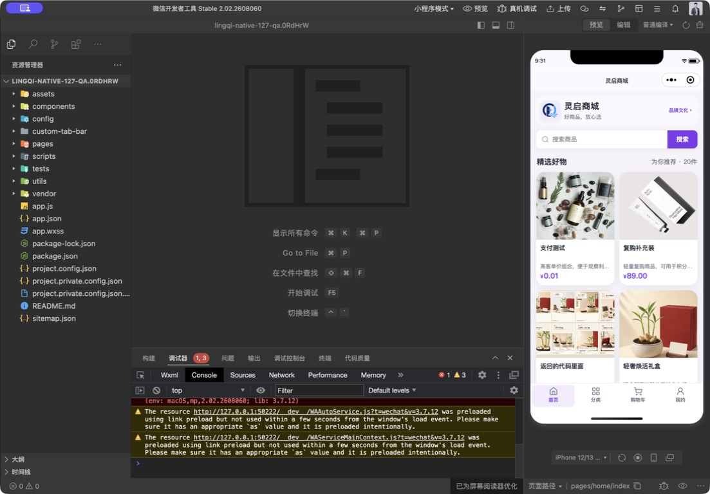
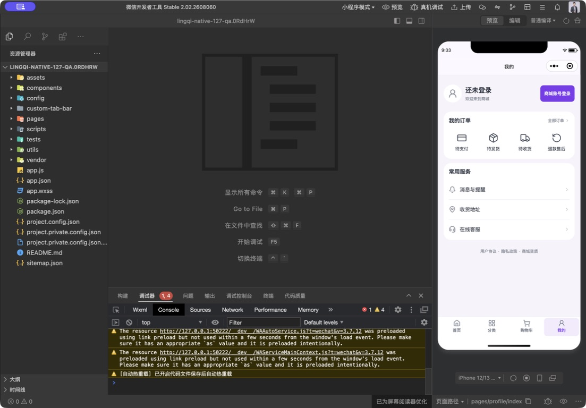
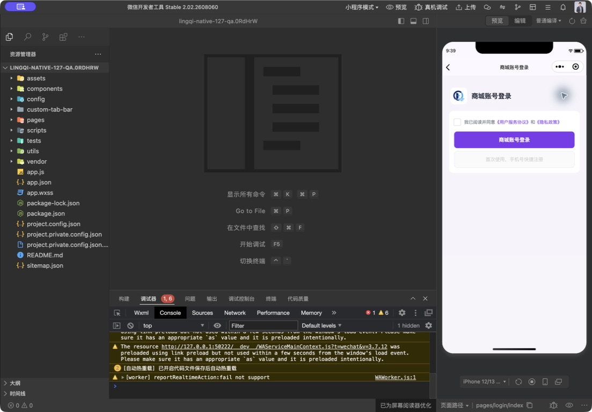

# 小程序与公开 H5 对齐、微信能力与优化计划

日期：2026-09-06（Asia/Shanghai）

检查基线：`codex/security-membership-payout` / `9bb074b1` / 本地 `1.0.127`。

本轮性质：只读检查与规划，不修改产品代码、业务规则、客户数据或线上开关，不上传、提审或发布。本表是逐项执行的基线，不是全流程验收合格证明。

## 一、结论及证据边界

小程序已经是独立原生商城，并非 H5 套壳；购物、售后、资料及微信支付的基础代码已经存在，但“代码存在、线上配置就绪、平台资格通过、真机交易成功”是四个不同状态。目前不能判定已经具备完整上线交易条件。

- 对齐对象是当前源码中的**公开商城 H5**，不把团队 H5 和可选一体化 H5 的所有功能当作小程序遗漏。
- 本轮核对了原生页面、公开 H5 路由与关键页面、共享后端微信登录/支付/退款/发货/订阅实现及线上公开能力接口。没有登录生产后台核验商户权限、证书、模板或平台审核结果。
- 2026-09-06 约09:33线上只读结果：`/api/shop/pay/config` 返回 `wechatPayEnabled=false`、`alipayEnabled=false`；`/api/shop/wechat-mini-program/runtime` 返回登录及手机号授权配置为 `true`，订阅消息和微信发货同步为 `false`，模板为空。
- `runtime.paymentEnabled` 当前固定返回 `false`，不能单凭这个字段判断支付；上述支付结论来自独立支付配置接口。需要统一能力状态的解释，避免以后两个接口误导客户。
- 用户反馈微信手机号组件需要先完成认证；本轮没有重新确认认证进度。服务器“手机号授权已配置”不等于微信已经准许该账号使用组件。
- 当前公开网页 `version.json` 为 `1.0.115`。后端 `1.0.126`、小程序开发版 `1.0.126` 的状态来自交接报告，本轮未重新进入公众平台验证；本地原生 UI `1.0.127` 尚未上传。不同端版本号不需要强制相同，但必须记录源码和配套接口版本，不能拿本地界面冒充线上界面。
- 本轮重新执行小程序自动测试 **183/183通过**，工程结构、JSON、JavaScript、HTTPS配置检查通过。这些主要是自动回归，不替代微信真机授权或资金验收。本轮没有重新执行后端全量测试，也没有宣称进行了完整安全审计。

## 二、应该相同与应该不同的部分

| 能力 | 公开 H5 | 小程序应采用的方式 | 必须保持一致的部分 |
|---|---|---|---|
| 登录/注册 | 账号密码、短信验证 | 微信已绑定账号快捷登录；首次手机号授权；补安全的替代入口 | 同一手机号对应同一商城账号，不重复开户，不绕过账号禁用和归属校验 |
| 邀请关系 | 可选手填；扫码自动带入并锁定；核对邀请人 | 同样支持手填和扫码；再适配小程序场景参数 | 普通购物不强制邀请码；首次注册一次绑定；已注册账号不自动改绑；邀请资格由后台有效会员规则判断 |
| 头像/昵称 | 手动填写、上传 | 主动选择微信头像、昵称输入，同时允许手动选择/填写 | 保存到同一商城资料；不强制完善资料才能购物；不能假定微信自动提供所有资料 |
| 收货地址 | 手动新增和编辑 | 微信地址导入后核对保存，保留手填 | 同一地址簿、默认地址和配送校验；收货人手机号不能拿来替换登录手机号 |
| 支付 | 已有余额和按配置展示的支付宝路径 | 微信原生收银台；余额作为业务对齐项补充 | 后端定价、运费、库存、限购、幂等及实付金额；支付页面不同不代表账务规则不同 |
| 提醒 | 站内消息及配置允许的其他渠道 | 站内消息 + 用户主动订阅的微信提醒 | 同一业务事件与最终状态；不能承诺授权一次就永久提醒 |
| 客服 | 在线客服/客服工单 | 原生微信客服作为快捷入口，业务工单保持可追踪 | 订单、售后、回复历史与处理责任不能丢失 |
| 装修 | 网页布局 | 适配原生导航、安全区、原生组件的布局 | 品牌、颜色、模块开关、排序、商品及活动数据来自后台；不要求逐像素照搬 H5 |
| 团队管理 | 独立团队 H5 承载 | 默认不搬到公开小程序 | 会员有效性、团队权限和资金规则仍由后端裁定，不能由是否购买或页面按钮决定 |
| 发布 | 网站静态资源发布 | 上传开发版→体验版验收→审核→发布 | 统一版本登记、接口兼容与回滚依据；两套发布流程各自验收 |

微信支付官方说明：小程序与 JSAPI 共享权限及下单接口，但调起方式不同；认证、商户号绑定及交易类订单发货管理也需要完成。不能因为 H5 能展示支付入口就认为小程序已经可支付。[微信支付开发接入准备](https://pay.wechatpay.cn/doc/v3/merchant/4015459512)

## 三、逐项优化与验收表

状态：**待补**＝代码有缺口；**待配置**＝已有实现但运行/平台条件未完成；**待验收**＝存在实现但没有当前真机闭环证据；**待决策**＝客户业务范围决定是否做。P0 是开放真实业务前优先项，P1 是关键体验对齐，P2 是后续增强。未开始项不打勾。

| 编号/优先级 | 项目 | 已核实现状 | 计划动作 | 完成标准 / 依赖 |
|---|---|---|---|---|
| 01 · P0 | 登录与授权失败提示 | 往返登录和手机号注册均已有；取消、没有权限、缺少授权码统一显示“需要手机号授权”，原因不准确。H5老账号第一次绑定微信也会被引导为“首次注册” | 区分取消、平台能力不可用、服务失败；明确老账号绑定与新账号注册；统一未勾协议时的按钮反馈 | 新用户、已绑定用户、H5老用户首次绑定、拒绝授权四种路径可辨认；不自动创建重复账号 |
| 02 · P0 | 注册/登录替代入口 | 小程序没有 H5 的短信或密码登录入口，手机号组件不可用时首次使用被卡住 | 设计并补短信验证登录/注册与必要的账号登录入口；独立完成微信身份绑定，保留验证码防刷、限流和隐私处理 | 微信授权失败可安全恢复；不能只填写手机号就绑定；短信供应商及真实送达需配置与验收 |
| 03 · P0 | 邀请码手填与扫码 | 小程序能接收启动参数/scene邀请码，但只有显示，没有手填或邀请人预览；H5公开注册两者都有 | 补可选手填、脱敏邀请人核对、扫码自动带入/锁定与错误修正；核对分享来源到首次注册全链路 | 无码可购物注册；无效/停用邀请人被拒；首次一次绑定；已有账号不被改绑；不改变客户已配置的会员开通模式 |
| 04 · P0 | 微信能力就绪清单 | 服务器登录/手机号标志为true，但微信资格仍待核验；支付独立配置为false | 建立“代码/运行配置/平台资格/真机验收”四列检查，整合已有后台就绪信息；不展示密钥 | 认证、正确AppID、手机号能力、商户权限、模板、域名都可逐项确认；不能只用一个开关宣称全部就绪 |
| 05 · P0 | 微信收款 | 有原生调起、后端预下单、查询、签名校验和支付回调；线上未开启 | 核对商户号/AppID绑定、密钥证书、回调地址后做受控资金联调 | 经用户批准的小额真实支付：付款成功、主动取消、网络中断、重复点击、回调重试、超时关单；商城账与渠道账一致 |
| 06 · P0 | 支付入口与中断恢复 | 结算、订单列表已有支付；订单详情只有取消/收货/售后，没有继续付款 | 订单详情补付款及状态恢复，统一待付款/实付金额文案；支付后以服务端结果展示 | 从订单列表、详情、微信订单中心均可恢复正确订单；未知结果不得显示已付款或重复下单 |
| 07 · P0 | 微信退款 | 官方退款调用、退款通知及本地协调已有，非只有本地改状态 | 配合支付验证全额、部分、多次部分退款与晚到付款退款，完善用户可理解的处理中/失败提示 | 不超退、不重复退；“退款完成”必须有渠道最终结果；失败可追查；资金测试单独授权 |
| 08 · P0 | 微信订单/发货管理 | 本地发货及部分售后退款路径会登记微信同步任务；支持重试及异常台账；线上同步未开启 | 核对公众平台订单录入/回跳设置与后端开关；验收拆单、多包裹、部分退款后履约、错误快递及重试 | 微信侧与商城侧都能找回本人订单；上传成功可追踪；本地发货成功不冒充微信同步成功 |
| 09 · P0 · 待决策 | 多商户收款与结算模式 | 当前微信网关使用单个配置商户号，不是按入驻商户传特约商户号的实现 | 交付前明确是自营单商户，还是多商户平台对应的支付/结算产品；如需渠道分账或服务商方案，独立评估 | 资金归属与所选微信产品匹配；不能把内部商家结算表当成微信渠道自动分账；不擅自修改结算账户 |
| 10 · P1 | 头像与昵称 | `chooseAvatar`、头像上传、微信昵称输入和手填已有；头像为私有读取 | 真机检查授权、取消、图片格式/大小、保存、重新进入和两端资料同步；调整个人资料入口与账号安全的信息分组 | 不强制取头像昵称；昵称审核清空等情况不误保存；头像跨账号不可见；拒绝后仍可正常购物 |
| 11 · P1 | 微信地址导入 | 已接 `wx.chooseAddress`；回填后需保存，取消可手填；原默认地址不直接覆盖 | 核对微信后台权限和隐私声明；真机走导入→修改→保存→结算回跳 | 不误覆盖未保存资料/默认地址；首地址、已有地址、拒绝、弱网和过长地址均正确 |
| 12 · P0 | 隐私声明与授权 | 已有独立隐私处理、后台政策展示、敏感资料保护；平台填写情况未复核 | 对照真实使用的信息项核对声明、用途、联系方式及授权时机；新增短信/资料能力同步补齐 | 浏览不强制取资料；每项按场景征得同意；拒绝后有替代；不在未实现时承诺自动注销或删除所有交易资料 |
| 13 · P1 | 余额支付与相关设置 | 公开H5结算含余额；小程序仅发送WECHAT，钱包为查看余额/流水 | 按公开商城业务补余额支付，同时补必要的支付密码/实名认证入口，不搬入团队奖金页 | 后端规则一致；余额不足、支付密码错误/锁定、重复点击、跨订单支付等受保护；微信和余额支付各自完整回归 |
| 14 · P1 | 发货、售后、退款、到账提醒 | 四类订阅事件、原生授权页及后端授权登记已写；线上未启用且模板为空 | 配置模板和发送任务；在订单/售后等相关位置加主动订阅入口，保留站内消息 | 拒绝不影响交易；模板匹配、发送失败/重试、额度耗尽和详情跳转逐项验证；“已订阅”不等于“已送达” |
| 15 · P1 | 微信提现收款确认 | 原生有提现记录和 `wx.requestMerchantTransfer` 收款确认，不是完整提现申请页；本轮未核验线上转账开通 | 对齐团队H5提现记录与原生收款确认；明确申请仍放团队端还是另行扩展 | 商家转账产品需单独开通/配置；保留既定一次审核与单笔超阈值人工审核规则；不把转账发起当成到账 |
| 16 · P1 | 客服与工单 | 小程序有微信原生客服；公开H5还有工单提交/详情/回复流程，小程序没有对应页 | 保留快捷联系客服，补可关联订单的工单入口、历史记录与处理状态 | 客服无人在线仍能提交并追踪问题；订单关联只允许本人；客服消息推送配置是否需要由接入方案决定 |
| 17 · P1 | 找回密码/换绑手机 | 小程序可设置账号、改昵称/密码，忘记密码和换手机号引导客服；H5有自助路径 | 按身份核验规则补自助入口或明确服务承诺；避免资料设置与密码变更混成大表单 | 找回/换绑前后会话和微信绑定规则明确；旧会话不能继续修改资料；不默认解除他人微信绑定 |
| 18 · P1 | 后台装修联动 | 小程序已有品牌/颜色、首页模块开关排序、布局模板、分类导购、底栏名称等解析；不是完全没接 | 为每个后台字段建立“两端支持/小程序替代/不适用”矩阵；补缺项和变更刷新提示 | 在隔离配置或经批准的测试环境逐项改值验收；不改生产装修测试；不承诺网页任意样式都可原样下发到原生 |
| 19 · P1 | 活动与内容跳转 | 活动、公告、品牌、新品及直播内容已有原生页；不支持的活动链接会提示无法打开 | 后台链接增加端类型校验/可用目标提示；原生页面、网页、其他小程序分别处理 | 发布前能发现无效入口；保留平台合法域名与跳转资格限制，不用关闭校验掩盖问题 |
| 20 · P2 | 商品评价 | 公开H5有商品评价接口/功能；原生未发现相应调用与页面 | 补评价浏览、已完成订单评价入口与必要的图片/文字处理 | 本人已购订单才可评价；重复评价、敏感内容、头像可见性与两端展示一致 |
| 21 · P1 | 分享及小程序码 | 已有接收邀请码能力，未发现原生 `onShareAppMessage` / `onShareTimeline` 配置 | 补商品分享与可恢复的落地页；邀请分享/专属码仅给有效会员，来源规则与手填邀请一致 | 分享返回正确商品；游客可浏览；非会员不生成带邀请能力的内容；普通H5二维码不会被假定自动变成小程序码 |
| 22 · P2 | UI与浏览体验 | 本轮首页/游客我的/登录能显示；搜索、规格、购物车已有前轮优化 | 按页面逐项统一主按钮、空/错/加载状态、价格层级、长标题、安全区及320宽显示；保留后台主题 | 每次只改一组页面，提交原生前后截图、实际点击及回归结果；不把整个H5页面缩小当小程序设计 |
| 23 · P2 · 待决策 | 直播互动 | 原生已有列表和支持的视频播放路径；H5另有预约、评论、互动和主播侧能力 | 先明确是否交付直播能力；如需要再选原生平台能力并做资格/媒体格式验证 | 未承诺的主播后台不列强制遗漏；不能把“列表能打开”说成完整直播已接通 |
| 24 · P1 | 会话、弱网与新版更新 | 原生已有会话失效、敏感请求和异步隔离处理；未发现 `getUpdateManager` 接入 | 验证会话到期/切后台/换账号/断网恢复；加用户可控的新版更新提示，避免交易中强制重启 | 不丢待支付订单和未保存输入；不以更新小程序替代刷新后台装修；两端登录有效期按各端策略验证 |
| 25 · P1 | 图片/加载性能与错误定位 | 有私有头像和媒体URL处理；开发工具仍有基础库兼容性与预加载等提示 | 区分工具警告和业务异常，收集脱敏错误编号；检查图片尺寸、懒加载、列表分页、网络请求 | 低网速下仍有恢复入口；不缓存密码/验证码或把令牌写入日志；兼容性问题应可复现后再处理 |
| 26 · P0 | 资金与账号回归门禁 | 代码中存在后端金额/归属/回调校验与敏感字段保护；本轮183项原生回归通过 | 每批涉及共享后端时同步跑H5和后端对应回归；资金变更补重复通知/金额错误/越权/跨会话测试 | 不声称“没有任何安全风险”；原生表单、上传、请求、日志和资金状态都纳入检查；跨端共用逻辑不可只验小程序 |
| 27 · P0 | 发布验收与版本登记 | 本地原生127、记录中开发版126、网页115；平台当前审核/正式版本未复核 | 发布前核对AppID、源代码、包版本、配套服务器、隐私/权限/订单配置，建立固定验收单 | 原生真机完成注册→资料→下单→付款→发货→售后→退款；提醒和转账按启用范围验收；上传成功不等于发布成功 |

## 四、执行顺序与暂停条件

1. **第一批：登录和注册可用。** 01→03→02→04，并同步12。先修清楚授权失败、老用户绑定和邀请码，补安全替代入口；认证由客户完成，不等待认证期间反复改没有资格的微信组件。普通购物账号与有效会员权限保持区分。
2. **第二批：完整成交与退款。** 先确认09的收款模式，再04→05→06→07→08；资金安全门禁26贯穿。配置核对先于开启收款。没有真实渠道验收，不升级为“已完成”。
3. **第三批：资料与服务闭环。** 10→11→14→16→17；13按公开商城余额支付对齐；15只补已确认范围内的原生收款环节，不擅自把团队端全部迁进小程序。
4. **第四批：装修、UI及原生体验。** 18→19→21→22→24→25，最后按需要做20和23。每批小范围实现、回归、原生截图，不持续叠加未验收改动。
5. **第五批：按27执行体验版及正式发布验收。** 真机授权须客户在自己的微信上确认；发生实际扣款、退款、提现或新增平台服务，先明确测试目标和授权，不自动代扣。审核/认证未通过时只完成不依赖资格的工作。

每项状态依次为：待处理→开发完成→自动回归通过→原生页面通过→真机/渠道通过（需要时）→已发布。完成时记录提交、影响端、测试证据和发布状态，不能只写“已优化”。

## 五、本轮原生页面体验检查

使用产品体验审查流程，保存并重新打开了本轮原生工具的原始截图；没有用H5截图替代。运行副本为 `/private/tmp/lingqi-native-127-qa.0RdHrW`，390×844模拟器，未代用户勾协议或授权。截图包含开发工具全窗，未裁剪/加工。

### 步骤1：首页——基本正常，登录后业务未验证

品牌、搜索、双列商品和底栏显示正常。测试商品名称、测试金额不作为缺陷；本轮不清理数据。对比度、动态字号和读屏完整可用性仍需专项验证。

### 步骤2：游客“我的”——基本正常，账号入口仍可优化

访客状态清楚，登录入口和四个订单快捷项可见，客服与地址有入口。读屏树中游客头像区仍使用“编辑头像和昵称”的语义，需要与游客实际动作统一。登录后的真实角标、资料和订单不计通过。

### 步骤3：登录——页面可达，存在指引问题

能从“我的”进入登录；未勾协议时注册禁用、登录按钮仍呈主操作色（代码点击后提示同意），反馈应统一。没有可选邀请码输入，现有首次注册文案不能准确覆盖H5老用户首次绑定。授权失败原因见源码核对；本轮没有实际触发微信授权失败来伪造复现。

### 步骤4：真实授权及登录后交易——待验收

手机号资格依据用户最新反馈仍待认证，本轮不代用户授权；支付运行配置关闭。因此没有采集真实注册成功、头像授权成功、下单付款、退款或到账截图。开发工具存在既有基础库兼容性报错与预加载/worker提示，也不记为“零错误”。

## 六、代码定位与检查依据

以下为当前源码定位，用于逐项实现时复查，不等于各接口已经线上实测。

- 两端范围：`mall-shop-web/src/router/index.js`、`src/surfaces/public/PublicLoginView.vue`、`src/surfaces/public/PublicWalletView.vue`、`src/surfaces/public/commercePolicy.js`、`src/surfaces/team/router.js`；H5结算 `src/views/CheckoutView.vue`。
- 原生登录、邀请码及资料：`mall-mini-program/pages/login/index.js` / `.wxml`、`utils/auth.js`、`utils/invite.js`、`pages/account-security/index.js` / `.wxml`、`utils/member-avatar.js`、`utils/wechat-address.js`、`pages/address/index.js`。
- 后端身份：`mall-distribution/src/main/java/com/macro/mall/distribution/service/WeChatMiniProgramAuthService.java`、`WeChatMiniProgramAccountService.java`、`service/impl/ShopAuthServiceImpl.java`。已存在验证手机号匹配原账号、有效邀请人检查和按客户推广开通模式处理的路径；不据此自行改变会员规则。
- 资金：原生 `utils/payment.js`、`pages/checkout/index.js`、`pages/orders/index.js`、`pages/order-detail/index.js` / `.wxml`；后端 `service/impl/WeChatPayServiceImpl.java`、`wechat/OfficialWeChatPayGateway.java`、`config/WeChatPayProperties.java`。网关使用官方SDK的JSAPI预支付、查单、关单、通知解析和退款实现。
- 履约：后端 `service/WeChatShippingInfoService.java`、`WeChatShippingOperationsService.java`；入队触发位于 `service/impl/OrderShipmentServiceImpl.java`、`ShopAfterSaleServiceImpl.java`、`ExternalRefundCoordinator.java`；原生 `utils/order-center.js`、订单详情和售后页。
- 消息与转账：原生 `pages/subscriptions/index.js`、`pages/messages/`、`pages/payout/index.js`、`pages/wallet/index.js`；后端 `service/WeChatSubscriptionService.java`、`wechat/WeChatWithdrawalPayoutGateway.java`。
- 装修与原生能力：`mall-mini-program/utils/display-config.js`、`utils/theme.js`、`pages/home/`、`pages/store-content/`、`app.js`。未发现分享和更新管理调用，是当前代码搜索结论，不代表平台不支持。

官方微信小程序手机号/头像/订单中心页面本轮直接访问失败，因此没有把检索不到的规则当作已验证结论。微信支付接入条件引用本轮成功读取的官方文档；主体权限、额度、模板、隐私配置和跳转能力最终仍以对应客户的微信后台为准。
