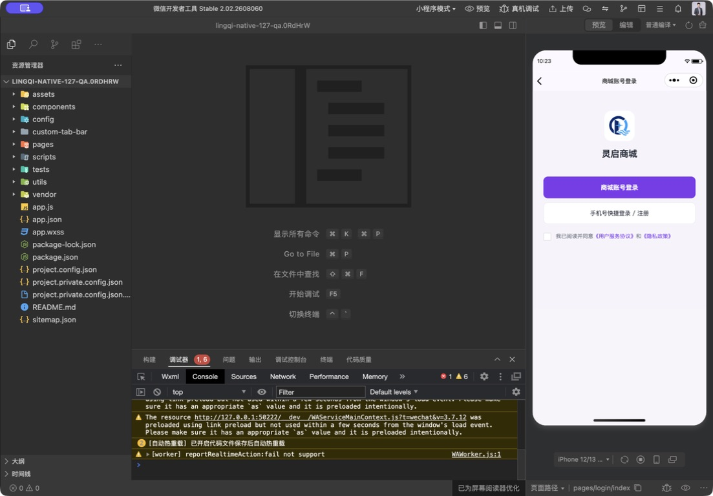
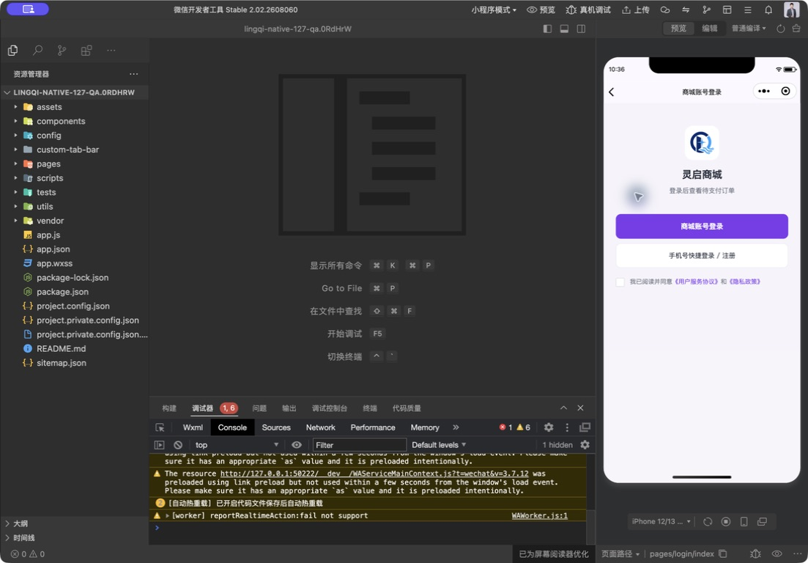

# 小程序产品总控规划与执行台账

更新：2026-09-06；负责人：当前 Codex 总控。基线：`776b4f2f` / 本地1.0.128。适用：通用商城基座的原生小程序，不是某个客户的正式交付验收。

## 1. 总控结论与职责

小程序不是公开H5的逐页复刻，更不是团队H5的缩小版。共用交易事实与权限，按微信环境重新组织操作。此前按用户逐个指出的问题做修补、把样式统一放在功能清单末尾，缺少先确定页面职责和用户路径的过程；189项自动测试通过也不能证明体验合理或交易能上线。1.0.128是排版修复，不是整套产品设计已验收。

本文件是**原生小程序当前执行顺序的唯一入口**。原27项[能力盘点](MINI_PROGRAM_OPTIMIZATION_PLAN_2026-09-06.md)保留作技术依据，状态和顺序以本表及最新RELEASE_REPORT为准。继续任务先读总表和发布报告，不另建互不关联的优化清单。产品基座边界仍遵守[产品总控交接](PRODUCT_CONTROL_HANDOFF.md)，平台当前版本以发布报告及现场核验为准。

总控负责：判断需求范围→明确用户任务→定页面结构与状态→划分缺陷/配置/功能/设计→按依赖实施→自动回归与原生目测→要求必要的真机/渠道证据→决定是否具备发布条件。只有资质、账号验证、实际资金、客户制度等必须由用户确认的事项再请求用户参与；不让用户充当逐页找Bug和设计审核的唯一责任人。

## 2. 业务一致，交互有差异

| 维度 | 必须共用的事实或规则 | 小程序设计决定 |
| --- | --- | --- |
| 商品、价格、库存、运费 | 后端报价、可售范围、活动、限购、订单幂等 | 原生分类/搜索、规格选择、底部购买区；不复制网页的大段后台式表单 |
| 登录与会员 | 同一商城账号；普通账号与有效会员资格区分；已有账号不能因扫码改绑 | 先逛后登录；微信快捷登录、手机号核验按状态递进；不把所有用户当首次注册 |
| 邀请 | 可选、首注一次绑定、有效邀请人和会员权限由后端判断 | 手填与扫码分清来源，展示脱敏邀请人核对；不强制购买会员或开放游客邀请 |
| 头像、昵称、地址 | 同一商城资料及本人权限 | 使用用户主动选择的微信能力，保留手动入口；不索要不需要的定位或资料 |
| 支付与售后 | 支付金额、回调、退款、资金归属和订单状态共用后端 | 微信原生收银台，支付中断能找回原订单；客户端成功不等于到账 |
| 消息 | 同一订单/售后/资金事件 | 站内消息保底、微信订阅按场景主动请求；拒绝不影响交易 |
| 装修 | 品牌、颜色、模块内容/开关/顺序来自后台 | 按原生页面模板解释配置，不能承诺任意网页CSS生效；不改生产主题做试验 |
| 团队和商家经营 | 各自权限与审计不变 | 团队制度、收益宣传、商户审核、运营财务不搬进消费者首页；既有受控收款确认单独验收 |

## 3. 页面信息架构与设计准则

这是本产品的验收约束，不声称是所有主流App都相同的强制规则。以[微信官方设计团队的WeUI](https://github.com/Tencent/weui-wxss)作为原生基础组件参照，沿用已有品牌/图标/主题，不为了换风格反复更换全站颜色；本轮没有新增组件库依赖。

- 四个一级入口保持：首页（发现）／分类（寻找）／购物车（核对）／我的（履约与服务）。商品、结算、订单、售后、资料是任务页，不能都做成同一种大卡片。
- 一个任务页只突出当前状态下的主动作；次级动作降权。微信与手机号入口必须说明用途，不要求用户理解OpenID、绑定或接口开关。账号验证完整方案一次收口，不能只挪按钮就宣告登录设计完成。
- 登录：品牌→主登录动作→必要的替代方式→协议。保持默认未同意，点击只提示，不自动勾选；取消授权不是业务错误。首次需手机号时给下一步，不错误暗示老账号会重新注册。无资格时说明实际不可用，不诱导用户反复点。邀请码输入与扫码结果分开：扫码后核对公开昵称，不长期复述原始邀请码。新注册默认公开商城首页、已有账号返回原任务的规则在MC03/04一起核对，只允许受控商城目标，不回跳团队页面。
- 商品：图、价格/优惠、名称、规格/数量、配送/服务、详情；底部购物车／加入购物车／立即购买分清作用。规格抽屉和表单收口与价格、库存、安全区一起验，不只验“按钮能点”。
- 交易：收货信息→商品→优惠/运费/备注→支付方式→应付金额与确认；中断、取消、失败、待确认、成功是不同状态。订单详情应先说明状态和下一步，不能一律写“本次付款”。
- 我的：游客为精简登录入口、订单及通用服务；登录后显示本人资料与待办，资料编辑和账号安全分层。不可把错误/弱网伪装成零订单，也不能显示旧账号数据。
- 表单：固定标签、合适键盘、字段旁错误、输入保留、明确保存；微信导入先核对后保存。金额、状态、商家/商品名称的优先级高于编号和技术说明。
- 视觉基线：浅底、主题色用于主动作/选中态，常规标题600而非全部粗黑；主正文约28–30rpx、说明24–26rpx、标题32–40rpx，随平台字体另验。主按钮按44–48px触区验收，小屏不能靠无限缩字解决；协议视觉框可小但可点区域不能只剩图标。
- 容器间距、圆角、边线使用共用样式；原生胶囊、返回栈、底部安全区、键盘遮挡必须现场检查。价格/长标题/长地址不挤掉操作。禁止用装饰渐变、大阴影、重复标题填充空白。
- 每页覆盖游客/登录、加载、空、错误、成功、禁用、提交中；涉及金额再覆盖处理中/最终失败/取消。对比度、读屏和系统大字体另验，不能从截图宣称全面无障碍达标。

### 全部22页的职责与验收焦点（132新增提现页）

| 页面组（覆盖路由） | 设计职责 | 主要验收点 |
| --- | --- | --- |
| 首页 home | 品牌与发现商品，搜索优先，运营模块服务购物 | 模块开关/顺序、空商城、图片失败、搜索返回、后台变更刷新 |
| 分类 category | 分类定位与搜索结果，不混淆两个筛选 | 关键词保留、清空/无结果恢复、分页失败、重复请求 |
| 商品 product | 判断买什么、多少钱、何时可买 | SKU实时价格/库存、不可售、数量、加入/直购不串单 |
| 购物车 cart | 核对选择、数量及合计 | 价格变化、失效商品、取消勾选、删除确认、登录后任务衔接 |
| 登录 login | 以最少必要步骤验证身份并继续原任务 | 新/老/已绑定、拒绝/取消/异常、协议、邀请码、无手机号能力替代 |
| 我的 profile | 本人订单待办和服务入口 | 游客不暴露计数、点击目标保留、弱网与退出清理 |
| 资料/安全 account-security | 资料完善与凭据管理分组，不强制头像 | 头像昵称主动选择、取消、保存、切号、密码错误与强度、丢输入 |
| 地址 address | 选择地址或维护地址，两个任务明确 | 微信导入、手填、默认地址、新增返回、拒绝、键盘和长地址 |
| 结算 checkout | 最终核对交易后主动付款 | 报价变化、地址变化、运费、取消/重复点击、失败恢复 |
| 订单列表 orders | 按待办筛选并找到订单 | 筛选与状态一致、分页、未付款继续、售后状态与刷新 |
| 订单详情 order-detail | 状态、下一步、物流和付款依据 | 未付/实付文案、继续支付、联合单/子单、微信订单回跳 |
| 售后 after-sale | 选择商品/数量/原因并追踪处理 | 上传、申请失败保留、退货物流、退款处理中、撤销与换货 |
| 钱包 wallet、收款 payout | 仅在已确定范围内查看本人资金及受控收款 | 金额、处理中不冒充到账、再次进入、收款确认、不能新增营销/互转 |
| 消息 messages、message-detail | 分类读取业务结果并回到原订单 | 未读、删除/过期目标、权限、去重、列表返回保持筛选 |
| 订阅 subscriptions | 说明订阅用途与当前能力，用户主动选择 | 拒绝不阻断、模板未配、次数与送达区别、3+1分组 |
| 活动 campaign | 展示资格/规则与正确成交入口 | 时间/资格/不可售、独立报价、入口配置不支持时解释 |
| 公告 notices、内容 store-content | 运营内容与有效跳转 | 长文、返回、媒体失败、不支持链接、直播不冒充完整互动 |
| 商城说明 legal | 协议、隐私、资质、联系方式可找可读 | 后台内容、版本、联系方式缺失、授权信息与实际功能一致 |

## 4. 执行队列：先闭环，再扩展

编号长期保留。P0＝上线阻断/账号资金风险；P1＝核心体验；P2＝可后续增强。“待验收”不是Bug，“配置未就绪”不是功能已接通。UI不是统一放P2：阻断注册/付款的UI属于P0，主要交易体验属于P1。

| 编号 | 优先级 / 类型 | 决策与实施内容 | 通过条件 | 当前状态 / 原27项 |
| --- | --- | --- | --- | --- |
| MC01 | P0 / 授权反馈缺陷 | 取消、权限不足、不支持、网络错误、缺少返回码分流；老账号不称首次注册；提供可见重试/客服 | 失败不调用登录、不记录敏感返回；取消不自动授权；成功才提交有效code | 1.0.129代码/自动通过，原生真实授权事件待验，未发布；原01、12 |
| MC02 | P1 / 任务衔接缺陷 | “我的”各受保护入口携带准确目标，订单状态不能丢 | 游客待支付→登录→待支付；地址→登录→地址；取消回原页 | 1.0.130改为原位弹窗；代码/自动及390/320原生入口、关闭通过，真机登录成功后回跳待验，未发布；新增问题 |
| MC03 | P0 / 登录整体设计与兜底 | 主动作/替代方式按用户身份递进；补已验证的短信/账号替代，不在未接通时画假入口 | 新账号、H5老账号、已绑账号、拒绝、无能力、短信限流全链验证；不会重复开户 | 1.0.130整行入口、单主动作弹窗与协议下置已实现/自动/游客原生通过；原微信已关联登录保留。短信/账号替代及真机闭环仍待，不能整项判完成；原02、04 |
| MC04 | P0 / 邀请注册 | 手填可选、扫码来源明确、邀请人脱敏核对、首次一次绑定 | 无码可注册；无效/非有效会员邀请被后端拒；老账号不改绑 | 1.0.131代码/自动通过，后端已部署：补手填、核对、冲突选择、24小时过期提示/登录清理、来源记录；真正131原生同步/上传及真机仍待；原03、21 |
| MC05 | P0 / 配置与资金闸门 | 分别登记代码/服务器/平台资格/真机结果，核对商户收款模式 | 不把布尔开关当认证或支付成功；无密钥泄露；收款模式明确 | 待平台核验/业务决策；原04、09、26 |
| MC06 | P1 / 购物设计 | 首页/搜索/规格/购物车围绕发现→选择→核对一次收口 | 状态齐全、320/390与大字、异常恢复、后台模板组合；提供原生前后证据 | 132补首页加购、四入口累计限购与按账号购物车；272项及320/390原生隔离实点通过，真机/全部版型/大字仍待。详见跨端对照附件；原18、22、25 |
| MC07 | P0 / 订单支付恢复 | 详情补正确待付/实付说明与继续付款；联合单/子单路径核验 | 从各入口找回同一订单，不重复下单；未知结果不显示已付 | 待实施，先依赖MC05；原05、06 |
| MC08 | P0 / 履约退款闭环 | 订单中心/发货同步、包裹、取消、全/部分退款、对账及异常台账 | 渠道与商城结果一致，回调重复/迟到不重复动账；含微信端找回订单 | 待配置及受控资金验收；原07、08 |
| MC09 | P1 / 资料与地址 | 昵称/头像和安全操作分组；微信地址导入核对后保存，拒绝保留手填 | 真机取消/弱网/长地址/键盘/保存/切号全覆盖，跨端共享资料正确 | 代码存在，待原生登录态及真机验收；原10、11、17 |
| MC10 | P1 / 服务闭环 | 原生客服+可追踪业务工单，消息和订阅按业务场景 | 无人在线可追踪；用户拒绝不阻断交易；真实发送和跳转可证 | 待配置/补工单；原14、16 |
| MC11 | P1 / 资金相关端面 | 余额支付按业务及安全条件补；转账只做已确定的受控确认 | 后端规则共用，失败锁定/幂等/最终到账明确；不擅自搬团队功能 | 1.0.131先补本人会员资格与余额分离显示，代码/自动通过；不新增原生团队/奖金中心；资金项仍待MC05/08与范围确认；原13、15 |
| MC12 | P1 / 装修与内容 | 建后台字段→原生模板映射矩阵，限制不可用跳转 | 隔离配置逐项可测，不用改生产或关域名校验掩盖 | 待逐项实测；原18、19 |
| MC13 | P1 / 原生增强与稳定性 | 商品分享/符合资格的邀请、更新提示、切后台、弱网/会话恢复 | 分享落正确页；更新不打断支付；会话/日志不泄露资料 | 1.0.131好友分享与本人邀请资格门禁、换号/晚响应保护代码/自动通过；原生/真机未验，更新提示等仍待；原21、24、25 |
| MC14 | P2 / 可选扩展 | 评价与直播互动单独确认交付范围后安排 | 不因H5有就机械照搬；评价归属/内容安全与媒体能力独立验收 | 待范围确认；原20、23 |
| MC15 | P0 / 发版闸门 | 候选冻结、后台兼容、权限/隐私/订单配置、体验版与真机清单 | 启用的注册→下单→支付→发货→售后→退款闭环可证；无P0未决 | 待完成上述依赖；原12、26、27 |

执行批次：A=MC01/02（保留真机验收）→B=MC03/04（当前：登录注册完整方案）→C=MC05/07/08（成交履约；资质/资金待确认时不阻塞其他安全工作）→D=MC06/09（购物与个人服务设计）→E=MC10/12/13→F=MC11/14按确认范围→MC15。UI/可用性与每一批同时验，不拖到最后。

## 5. 缺陷处理与完成定义

每项先记录“现象、原因、影响用户、影响端、依赖、复现证据”，能自动复现的先写失败测试。修复后依次记录：开发完成→自动通过→原生显示/实点通过→真机或渠道通过（必要时）→已发布。不能用“已优化”合并这些状态。

- 账号/支付/退款/到账：拒绝、权限、归属、重复、超时、晚回调、跨会话是必须项；修改共享后端需要H5对应回归，纯小程序UI不发布H5。
- 页面设计：同尺寸同状态前后对照；320/390宽、安卓/iOS、长文/大字/键盘逐项登记。模拟器截图不能替代用户真机授权。
- 无法验收：标记具体依赖和负责动作，继续不依赖它的事项；不伪造身份、测试成功、配置已开或任意资金交易。
- 测试数据：商城是基座，不把测试商品/姓名/0.01金额本身当Bug，不清空商品或订单。交付清理单独制定备份、授权、初始化验收。
- 发布：用户说继续/优化只授权规划内开发，不授权上传、提审、正式发布、开支付、实际退款/提现或生产配置变更。记录本地/开发/体验/审核/正式版本的真实状态。

## 6. 本轮证据与边界

### 最新增量：1.0.132（跨端功能核对、加购与累计限购，未发布）

- [跨端功能对照与修复附件](MINI_H5_FUNCTION_ALIGNMENT_132.md)覆盖22个原生页面、同后端与端适配边界、已修和未修项；不是宣称全量功能对齐。不需要全部推翻设计，但必须独立验收启用的小程序完整交易链。
- 首页加购、共享规格弹层、详情/购物车加号历史限购、结算跨规格合并、同款新价格及账号购物车隔离已补；操作结果中央确认。旧共享缓存不删除、不自动分配，新版需明确提示重新加购，已有订单不变。
- 小程序272/H5 102/后端698通过，工程检查及官方26/27完整依赖编译通过；320/390原生隔离假数据验证首页加购、规格价格、跨入口限购且数量不变，测试商品已移除。未改H5/后端，未上传/部署；真实授权、真实交易及旧版其他门禁保留。
- MC07仍需补订单详情续付（列表已存在）；MC11原生余额支付、MC10工单、MC14评价等未在本批实现。首页空活动标题仍未修。不得用“共用后端”替代逐端验收。

### 1.0.131（邀请归属与会员能力，后端已部署、原生待同步验收）

- MC04与MC13的分享部分已补齐：原生好友卡片（首页/商品/我的）只带有效发送者的本人邀请码，登录前核对公开昵称；可手填、拒绝、显式处理冲突，缓存最长24小时，到期需重新核对或主动放弃。旧账户不换线；资格仍与归属分开，既有会员历史邀请码继续兼容。新注册默认首页，老账号保留原任务，协议不自动选中。
- MC11仅新增中性的“购物账号/会员服务已开通”和本人钱包不受身份查询失败影响；来自新增后台认证能力，不按余额、邀请人或本地缓存推算会员。未搬团队等级/关系树/奖金方案、收益总额或提现申请；奖金引擎与客户制度未改。
- 小程序228/228、H5 102/102、后端691/691和官方编译通过；新增集成回归使用真实客户端模块＋模拟外部接口，后端使用本地测试库/模拟依赖，不是假装实际微信授权成功。Mac锁屏已请求解锁；原生新界面、真机两账号分享/注册及到账仍待，不复用130截图充数。
- 发布依赖：14:20–14:21按用户单独授权完成配套后端131部署与备份/健康/匿名接口保护验收，配置和三站静态不变，详见[131发布记录](RELEASE_CANDIDATE_1.0.131.md)。用户平台截图有131体验标签，但开发工具目录仍130源码，需同步真正131原生代码再上传。没有代用户分享消息、同意协议、注册或资金操作；原生/双账号真机未验，不能宣布全流程已上线。范围和逐项验收见[131验收记录](qa/2026-09-06-mini-invite-capabilities-131.md)。

### 1.0.130（用户确认的统一登录入口，历史记录）

- “我的”整行头像/登录文字/箭头进入原位底部弹窗；正常状态一个手机号主动作、协议下置，保留原账户与扫码邀请码规则。已关联微信可在取消或异常时主动使用原入口，不新增虚假的短信登录；MC04手填与邀请人核对未在本轮补齐。
- 208/208回归、工程/官方编译通过；390/320原生实点入口、协议未选提示、政策往返、遮罩/关闭、订单及地址任务说明。原登录路由复用组件，保留商品/结算等深链。截图与视觉迭代见[design-qa.md](../design-qa.md)。
- 登录后原位资料与业务回跳仅自动验收，真实手机号、新/老账户匹配和渠道授权仍需本人真机；用户反馈已认证，不据此推断手机号额度或支付/订阅等能力均就绪。没有上传、提审、发布、H5/后端/线上配置改动。

### 1.0.129基线证据（历史记录保留）

本轮重新在原生390宽采集登录、游客我的，以及点击待支付后的登录页；不复用H5截图或上轮截图作现场证据。授权错误分流由源码和回归验证，未代用户勾协议或触发真实手机号授权。真实登录成功与资金测试仍待用户资格/测试授权。

检查来源：`pages/login/index.js` 的 `phoneLogin` 将所有不成功返回合并为首次注册提示；`pages/profile/index.js` 的 `requireLogin` 没有目标参数；`pages/order-detail/index.wxml` 有固定“本次付款”说明且无继续付款按钮。前两项本批处理，订单项留在MC07，不趁本轮UI工作改动付款行为。

线上公开version.json本轮只读仍为1.0.115；后端126/已上传原生126来自发布报告，不冒充本轮平台核验。微信官方小程序设计/手机号文档本轮访问失败；不因此推断平台规则有改变，也不声称完成竞品/官方规范全面审查。WeUI仅作为微信生态组件参照，不替代本产品任务设计和实际资格检查。

### 本批结果：1.0.129（未上传）

- 先复现：手机号提示类4项用例失败；原入口丢失目标及过期显示/非法筛选2项用例失败，再实施修复。最终小程序197/197（新增8项），工程检查、官方23个WXML和24个WXSS、差异格式检查通过。独立原生副本162文件与源码一致，包版本129；排除原AppID/开发工具私有配置。
- MC01：只在现有登录页增加正常提示/错误与恢复分流，不改后端开户、绑定或会员规则；原生事件errMsg只能辅助解释，未知情况保持通用提示，真实各版本微信返回仍待验。不把资质问题归咎用户，亦不根据错误文字断定认证失败。
- MC02：所有个人中心受保护入口统一携带目标，订单筛选白名单；已有登录显示但本地令牌不存在时继续拦截。登录页只从预定义任务名称生成说明，任意来源参数不回显。返回动作不自动下单、付款或同意协议。

现场步骤及状态：

1. **当前登录基线：可达，但缺少任务说明。** 本轮未勾协议截图（下图）；两种登录方式的整体信息架构仍留在MC03，未宣称靠本批修完。
2. **游客我的：入口可达。** 点击待支付进入登录；源码及回归确认旧版不传目标，修复后带完整筛选。
3. **新版待支付登录：入口上下文显示通过。** 显示“登录后查看待支付订单”，协议仍未选；返回恢复我的。地址入口同样显示对应任务。截图是实际入口产生，不是注入登录或伪造个人数据。
4. **授权成功及原业务页：真机未验。** 成功回跳、无令牌不跳转、取消/能力错误/缺码、重新尝试由自动用例覆盖，仍需合法资格与用户本人真机确认；没有下单或动资金。

补充截图：[游客我的](qa/2026-09-06-product-control-129/02-profile.jpg)、[地址任务登录](qa/2026-09-06-product-control-129/04-address-login-after.jpg)。本轮原生390宽目测，不沿用上轮320宽结果冒充本批完成；系统字体、键盘、授权错误面板长文和安卓真机仍待验。当前工具基础库兼容性报错仍在，不声称控制台零错误。

下一批为MC03/04：将登录身份路径、可验证替代方式、邀请码与异常恢复一起设计/实现；当前没有把短信或邀请码手填功能画成可用入口，也没有改变正在审核或已发布版本。
