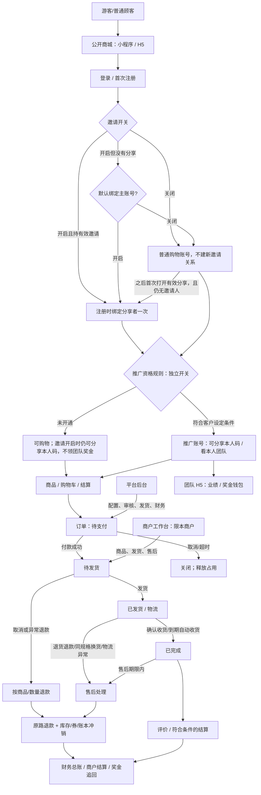

# 灵启商城当前产品功能图与规则说明

> 事实快照：2026-10-01，1.0.175 固定产品 `012770fd`；继承174业务规则，仅新增员工认证卡原权限显示条件修复。面向通用私域商城基座，不是任何客户的正式经营配置。本文说明**当前代码如何运行**，不替代 [收口总账](MALL_CLOSURE_LEDGER.md) 的发布和验收结论，也不是新增功能需求。较早的 [产品蓝图](PRODUCT_FUNCTION_BLUEPRINT.md) 使用 1.0.100/101 时点，部分支付和小程序判断已过时；遇到冲突以本图的源码核对和收口总账为准。

> 2026-10-02 更新：下方邀请章节为用户确认后的**后续源码，尚未发布**。固定服务器/微信开发版仍按176历史回执，原175快照描述是历史证据；本次没有重新查询线上。新注册可无邀请码，后续无邀请人账号可通过分享绑定一次，并增加默认主账号独立配置。

## 先看版本，不把“有功能”理解成“手机已经验证”

| 层次 | 本次核对到的事实 |
|---|---|
| 当前源码 | 邀请/资格/直接推荐佣金独立配置、订单退款逐件标识、财务渠道统计、设置中心边界及优惠券提示均已由1.0.175继承；本版只新增员工认证卡原权限显示修复。本文的规则描述不因分发自动成为真实验收结果。 |
| 服务器/微信开发版 | 2026-10-01 独立公网回读公开商城、后台和团队 H5 均为 `1.0.175 / 012770fd / 20261001-closure-1.0.175`；原包后端部署、45/45及备份/回滚独立核验和官方微信开发版上传已完成，见 [175回执](qa/2026-10-01-release-snapshot-175/README.md)。既有客户的邀请/资格/奖金设置未自动切换。 |
| 前序隔离运行（非175重跑） | 固定174原JAR新空库61组HTTP实跑、0失败；邀请/角色API、余额部分退款、正常退货及旧地址补配、实际佣金结算/追回和财务通过，见[运行报告](qa/2026-10-01-runtime-174/README.md)。175未重复实跑，不代表手机、真实短信、外部渠道或全部配置组合已验。 |
| 微信体验版/真机 | 1.0.175 体验版指向、手机版本及受影响链路的真机结果待确认；未提审或发布微信正式版。过去的真实支付/退款成功记录保留，但不自动覆盖后来改动。 |
| 客户交付 | 基座可派生客户项目，但客户的微信/支付宝、物流、ERP、奖金制度和实际开关组合仍要分别配置与验收。 |

图中“开启/关闭”是**客户级业务配置**，不是删除模块。关闭新交易通常仍要保留旧订单的付款回调、退款、资金清偿和审计。现有测试站曾只读确认邀请开启、推广资格为 `FIRST_PAID_ORDER`；这不是每个新客户的默认值，也不是今天对正式库的实时查询。

## 一张图看清端、角色和主链路

## 客户可以配置哪些开关

下表是“关闭后还能做什么”的产品规则，不代表当前测试站所有开关的实时值。新客户默认值来自创建服务；不能用数据库升级时保护老客户的默认值替代新客户创建流程。

| 配置 | 新客户创建时 | 开启 | 关闭后仍保留/禁止 |
|---|---|---|---|
| 邀请 | 关闭 | 新顾客无需邀请码即可注册；有效分享自动绑定一次；已注册未绑定者打开有效分享也绑定一次；所有有效购物账号可分享本人码 | 普通注册和购物继续；不建立**新**邀请关系，分享不带码；历史邀请关系、订单、奖金不删除 |
| 推广资格 | `MANUAL_REVIEW` 后台明确开通 | 另选受邀即开通或历史首笔有效支付订单模式；已有客户选择不自动更换 | 不自动赋予新的推广资格；是否已有资格和历史账本另行保留 |
| 基础直接推荐佣金 | 关闭，比例 0；默认范围为持续消费，结算等待 7 天 | 单独设置有效比例、首笔支付交易/持续消费及签收后等待天数；普通购买者也可为合格直接邀请人计佣 | 停止新支付订单计佣；历史订单依支付时的资格、关系和版本继续结算/退款追回，不重算 |
| 多商户新业务 | 仅平台自营 | 商户商品可按授权上架、下单、发货和结算 | 不新入驻/启用商户，不新上架/购买商户商品；旧商户订单继续履约、退款和结算 |
| 余额新交易 | 开启 | 可余额付款；钱包、人工调整等仍受密码、权限和风控约束 | 不新建余额交易/转账/人工加款；历史余额、旧单退款、奖金入账、提现清偿和流水保留 |
| 优惠券 | 开启（创建服务当前默认） | 平台发券；顾客领取、选券或不使用 | 停止新建/发行/领券/新订单用券；历史券、已建单支付核销和退款逆流程保留 |
| 秒杀 | 关闭 | 活动商品、价格、库存和限购按活动配置 | 不生成新秒杀交易；历史订单退款/恢复照原规则 |
| 复购区 | 关闭 | 按所选会员门槛和商品复购设置开放 | 不进入新复购交易；旧订单照原规则结清 |
| ERP 对接 | 需项目配置 | 已配置厂商时推单、接收回传 | 不向停用对接继续外推新/旧待推任务；历史订单与记录留存 |

这些开关不等于任意组合已真实交付。支付渠道、微信物流、短信、实名、自动打款等还有第三方开通条件；详见 [客户模块选择与放行门禁](customer-project/MODULE_COMPOSITION_GATE.md)。

## 邀请：可直接注册，分享绑定一次（后续源码，未发布）

| 场景 | 用户确认后的规则 |
|---|---|
| 没有邀请码 | 手机号授权或普通注册创建账号；默认绑定关闭时没有邀请人。第一个普通顾客同样可以注册。 |
| 带有效分享注册 | 自动带入、核对分享者，注册事务中绑定一次，不要求手填。 |
| 已注册但没有邀请人 | 小程序和公开H5打开有效分享后，登录态自动请求本人首次绑定；游客先登录再绑定。 |
| 已经有邀请人/旧推广上级 | 返回已经绑定，任何新分享都不换上级。 |
| 默认绑定主账号 | 独立开关默认关闭；邀请功能开启时，有效分享优先，没有分享的新注册才绑定指定普通商城主账号。默认绑定后也不换上级。旧账号不批量绑定。 |
| 可配置的主账号 | 需已有、启用的非系统顾客账号；以该账号的8位本人邀请码指定，兼容历史有效推广码。后台管理员和系统资金账号不能作为目标。 |
| 邀请功能关闭 | 停止新的邀请绑定，新注册无需邀请码，历史关系和账务保留；默认主账号配置保留但不生效。 |
| 自己、禁用账号、系统账号、循环关系 | 自己不绑定，其他无效目标拒绝；服务端事务锁和条件更新防并发重复绑定。 |
| 分享权与佣金 | 有效普通顾客也可分享本人码；推广资格及佣金仍是独立规则。已有订单按其原快照，不因为后绑定重算。 |
| 小程序A/B冲突 | 游客已有待核对邀请又收到不同邀请时保留现有选择交互；已登录账号接收本次分享，由服务端判断是否未绑定。缓存最多24小时，退出账号清除。 |
| 公开H5邀请暂存 | 当前有效分享在本标签页暂存最多24小时，跨登录跳转保留；以最新有效链接为准，已绑定关系不更换。退出账号清除。 |

后台路径：**商城设置 → 团队、秒杀与复购模式（页内标题“商城业务模块”）→ 邀请与推广资格**。页面需要平台 `config:bonus`，修改邀请或默认主账号还需要 `config:shop`。配置后点“保存设置 → 确认并保存”；本次未操作实际开关。

## 邀请、资格与佣金：三个独立判断

| 场景 | 基础直接推荐佣金开启后的结果 |
|---|---|
| A 有推广资格，B 是普通客户且绑定 A | B 买参与商品，按实际商品支付金额给 A 记待结佣金；B 不需要先成为会员，不因计佣自动升级 |
| B 分享给 C，但 B 无推广资格 | C 可绑定 B；C 购买不给 B 计佣，也不会跳过 B 给 A 计佣 |
| 邀请人停用、无推广资格、购买者无邀请人 | 本次支付不计佣；后来开通资格不能补算这笔旧订单 |
| 首笔支付交易模式 | 以本商城该顾客历史首次成功支付为准；买不计佣商品也消耗首笔资格，退款不重置，同一购物车支付拆出的子单均算该首笔交易 |
| 商品不参与、运费或优惠券 | 自营商品可设继承规则/不参与；商户商品默认不参与。运费与券抵扣金额不计佣，即使券由平台承担也不把优惠加回基数 |
| 结算与退款 | 支付冻结版本/直接邀请人/资格，先待结；已收货、售后保护期及签收后配置等待期都结束且无进行中售后才释放。成功退款只冲减参与商品对应佣金，待结减记、已结追回；已抵历史欠款的奖励退款时恢复原欠款，避免虚假减债 |
| 历史/客户定制制度 | 不自动替换；后台明确确认切换只影响后续支付，原订单按原版本结清。团队层级、分红和额外奖励不属于这套基础直推规则 |

后台位置：设置中心的业务配置 → 奖金配置；邀请与推广资格仍在独立的业务模式配置。修改佣金须平台管理员同时具备奖金配置与财务管理权限。

## 顾客交易与订单状态

| 环节 | 顾客看到/能做 | 后台/服务端约束 |
|---|---|---|
| 浏览和选购 | 首页、分类、搜索、商品详情、规格、库存、评价、购物车；可立即购买或购物车多商品结算 | 平台/商户商品按上架与模块开关过滤；下单前复核价格、库存、限购，不以页面旧价格为准 |
| 确认订单 | 收货地址、运费、可用券/不使用券、实际开放的支付方式、实付金额 | 报价与最终提交二次校验；多商户购物车按归属拆履约子单，统一交易支付；快照保存商品、优惠及服务承诺 |
| 待支付 `0` | 原单续付或取消；代码默认 **30 分钟**后超时关闭（实际部署值需读取运行配置） | 不记成功收款、奖金或归集；取消/超时释放库存及已占用优惠券，重复提交有幂等保护 |
| 待发货 `1` | 查看订单；可按商品/数量申请“取消并退款”，未退部分继续待发货 | 平台/商家可审核、手工或批量/ERP 发货；后台整单取消仅处理尚未退款的剩余商品；部分退通常不退运费 |
| 已发货 `2` | 查看包裹/物流、确认收货；符合条件时申请退货退款、同规格换货或物流异常退款 | 可单/多包裹、部分发货；未收到/拒收不伪装成已收货后的普通退货；代码默认发货 **15 天**且无处理中售后时自动收货（实际值可配置） |
| 已完成 `3` | 评价、期限内售后、查看付款与订单信息 | 有效订单才能按配置进入商户结算/奖金；售后或退款仍可能对原账本冲减 |
| 已关闭 `4` | 区分未支付取消、已退款关闭；保留查看记录 | 退款只有渠道确认成功才完成财务冲销；部分退款不应把仍履约的商品标成已退款 |

“同订单哪些件已退款”的逐件标识已纳入 **1.0.174 服务器/微信开发版**。订单列表/详情的 UI 与操作按钮仍需用本版真机复核；分发不代替实际页面验收。

## 售后、退款和钱的去向

| 触发 | 正常路线 | 不能混淆的点 |
|---|---|---|
| 已付款但未发货，顾客不想要 | 独立“取消并退款/异常退款”，可选择商品与数量，剩余继续履约 | 不是“仅退款”普通售后类型；部分退不退运费，剩余未发货商品全部退时按规则退运费 |
| 已发货且商品在顾客手中 | 退货退款：申请→审核→寄回/录入物流→商家收货→原路退款 | 新申请前需有可用退货地址；申请期限按客户设置，默认签收后 7 天，可选择下单起算；0 天表示关闭自助入口 |
| 已发货且商品问题需换货 | 同规格换货，审核及寄回后换货发出 | 换货不等同退款或奖金冲销；历史仅退款单只读留痕，不供顾客/后台新建 |
| 物流丢件、拒收、未收到 | 独立异常退款申请及审核 | 不要求顾客把未收到的商品寄回，也不应直接把订单当作正常签收 |
| 客服/平台特殊处理 | 后台有受权限约束的兜底处理与审计 | 不能把后台“强制退款”理解成可绕过真实渠道结果、重复退钱或删除记录 |
| 退款处理中/失败 | 等待渠道回调或主动查询恢复；保留请求与状态 | **渠道成功后**才回补余额、冲减奖金/商户货款/利润；库存另按未发货取消或确认收到退货等条件回补，已发货但没有商品退回的异常退款不增加可售库存；重复通知须幂等 |

售后记录有九态：`0 待审核`、`1 退款完成`、`2 已拒绝`、`3 已取消`、`4 待退货`、`5 待商家收货`、`6 退款处理中`、`7 待换货发出`、`8 换货已发出`。进行中售后不应被“待评价”入口抢占；终态仍保留完整历史。

## 其余功能按谁使用、受什么控制

| 功能域 | 当前产品行为 | 主要控制/边界 | 当前验收边界 |
|---|---|---|---|
| 商品与页面 | 平台维护商品/SKU/库存/分类/品牌/首页装修；商家仅本商户商品；前台展示服务标签 | 上下架、商品审核、库存限购、平台/商家归属；“设置中心”只放配置，业务操作留原菜单 | 路由与自动测试存在，真机多规格/售罄/失效项未逐状态验 |
| 优惠券 | 平台统一发行；按所选归属/商品/业务范围适用；每单最多一张、不叠加秒杀，买家可不用 | 适用范围与平台/商家/共同承担分开；券领取、占用、核销、取消释放、全退款退券按快照；商家自主发券及跨店通用券不在本基座承诺 | 后台“商家默认指定商品”已随174分发，自动测试通过；真实券全链待验 |
| 支付 | 按客户实际开通渠道显示微信、支付宝、余额；原单续付、回调/查询与重复回调处理 | 未配置渠道禁止新单；首次余额支付需设置独立 6 位密码，取消或失败不应多建单/多扣款 | 微信/余额有历史测试；1.0.175 首次密码新旧单真机未验；支付宝不能因有代码就认定客户已开通 |
| 订单后台/发货与物流 | 订单管理可查询、导出；发货可手填运单、**批量导入物流单号并发货**，或按配置走 ERP/微信快递；顾客看承运商、包裹、脱敏地址 | “导入物流并发货”不是导入外部销售订单；多包裹与剩余量须核对，微信物流插件/快递账号需平台实际配置；H5 外链与小程序官方界面不同 | 新订单真实运单、微信插件跳转、ERP 厂商联调未全验 |
| 余额与提现 | 本人钱包、可用/冻结/流水、余额支付、申请提现；后台审核与人工调账 | 余额新交易开关、密码/额度/权限/审计；关新交易不抹旧余额及退款 | 测试数据库/自动链路有证据；真实余额密码及提现完整流程未验 |
| 团队/奖金 | 具资格用户进入团队 H5 看本人业绩、团队、奖金、钱包；基础直推按上述独立配置；额外团队规则属于客户项目 | 邀请、资格、奖金三个判断分离，历史版本保留；普通购买者不必先开通资格 | 新基础直推已随1.0.174同版分发；同版双账号与真实单佣金核对未完成，不把本机合成数据验证写成微信真实交易通过 |
| 商户和财务 | 本商户订单、发货、售后、货款/提现；平台财务看订单实付、退款、归集、利润、资金与风控 | 本商户数据隔离；未支付/退款处理中不当作成功净收入；系统归集账户、重复回调及审计 | 既有资金缺口已修及只读核对；支付渠道分类和人工增加余额统计已随174上线，实际渠道到账仍按提供方回执另验 |
| 消息、客服、评价 | 订单/售后消息、客服工单、商品评价/回复 | 站内事件与 SSE，外部短信/微信通知需提供方配置；评价资格按真实订单与售后状态 | 外部消息可达性与全部角色实操未验 |
| 秒杀、复购、直播 | 可配置活动/专区，前台只显示启用且有内容的入口 | 秒杀库存/时段/限购、复购资格和商品池；直播需实际账号/内容 | 作为客户可选模块，不作为本轮最小交易闭环已全验 |
| ERP 与其他外部服务 | 通用配置、推单/发货回传骨架及日志 | 停用不再外推；具体厂商签名/字段/账号、实名、短信、自动打款需客户项目逐项联调 | 不把模拟任务或后台配置成功写成第三方开通 |
| 管理与安全 | 角色权限、设置中心、操作日志、审计、数据迁移与客户派生 | 前端隐藏外还需服务端按角色/商户/客户隔离；平台运营按最小权限授权 | 自动权限合同通过；逐角色菜单及旧直达链接运行验收待做 |

## 给产品决策的最短待确认清单

1. **是否要求 H5 也像小程序一样处理 A→B 冲突？** 现状不同；后续源码统一保证每个账号只首次绑定；无邀请人的旧普通账号可后绑定，已有上级不改线。
2. **客户究竟启用哪些模块与渠道？** 每个客户先按 [模块选择门禁](customer-project/MODULE_COMPOSITION_GATE.md) 冻结开关、资质和外部依赖，不能根据测试站页面推断。
3. **同版真实验收未完成的项目不写“完成”。** 尤其是邀请双账号、首次余额密码、部分退款逐件展示、真实券、微信物流、渠道/奖金/资金对账。完整 P0/P1/P2 和验收清单在 [收口总账](MALL_CLOSURE_LEDGER.md)。

### 本图主要核对来源

- 邀请前端：`mall-mini-program/utils/invite.js`、`login-invitation.js`、`login-flow.js`、`share.js`、`tests/invite-share-flow.test.mjs`；公开 H5 `mall-shop-web/src/surfaces/public/PublicLoginView.vue`。
- 邀请服务端：`ShopAuthServiceImpl`、`WeChatMiniProgramMemberService`、`ShopServiceImpl.getInviterPreview/getInviteInfo`、`PromotionJoinModeEnum`、`EffectiveMemberPolicy`；后台 `business-modes.vue`。
- 订单/售后期限：`ShopServiceImpl`、`ShopAfterSaleWindowPolicy`、`ShopAfterSaleServiceImpl`；其余功能、角色和证据层级见 [收口总账](MALL_CLOSURE_LEDGER.md)、[客户模块选择与放行门禁](customer-project/MODULE_COMPOSITION_GATE.md)。
