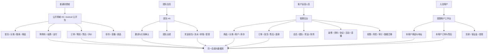
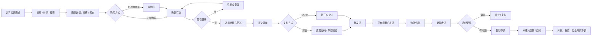
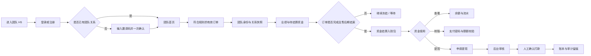
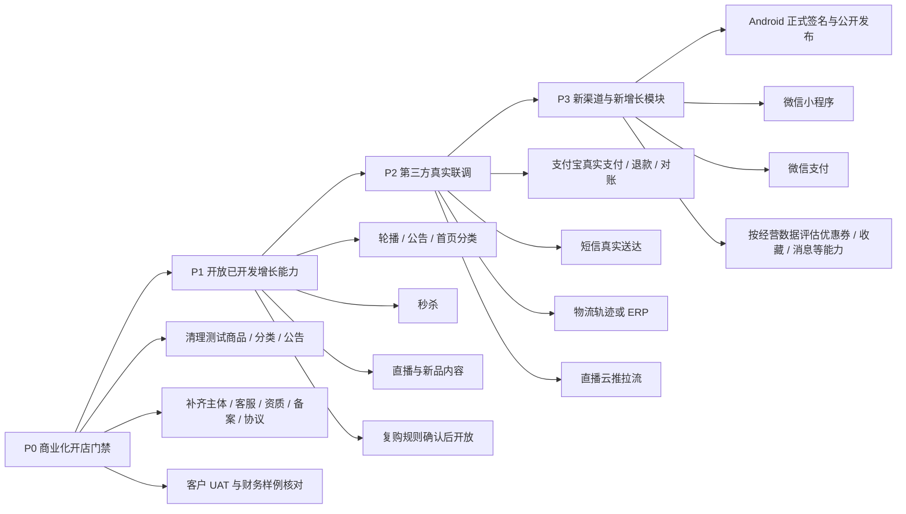

# 灵启商城产品全景、流程与实施规划

更新时间：2026-08-23（Asia/Shanghai）  
产品基座：App / 小程序公开商城 + 团队 H5 拆分版（可选一体化 H5）  
线上版本：`1.0.80`  
本地候选版本：`1.0.81`（待发布）

## 一、产品经理结论

本商城不适合只用一张“思维导图”表达。思维导图适合罗列功能，但不能准确表现用户先后步骤、角色交接、功能是否开放、外部依赖和上线优先级。

建议以以下四件套作为长期产品管理基线：

1. **产品全景图**：说明各端、各角色和业务域的边界。
2. **核心业务流程图**：说明消费者、团队会员、平台和商户如何协作。
3. **功能状态矩阵**：区分“已开发、已上线、已开放、待配置、待外部联调、未开发”。
4. **分阶段路线图**：明确先完成商业化开店，再开放增长功能，最后建设新渠道。

## 二、状态口径

| 状态 | 定义 | 产品含义 |
| --- | --- | --- |
| 🟢 已上线开放 | 代码、线上版本、入口和基本流程均存在 | 可进入正常运营，但仍需持续观察数据 |
| 🟡 已上线未开放 | 代码已上线，但开关关闭、无有效内容或未对用户展示 | 不应当作“未开发”，需要运营配置后开放 |
| 🔵 已开发待发布 | 已在本地候选版完成并验证，尚未进入线上 | 随下一次受控发版上线 |
| 🟠 待外部条件 | 产品框架已具备，但依赖客户资料、第三方账号、签约、密钥或真实联调 | 条件不齐时不得对外承诺可用 |
| ⚪ 未开发 | 当前没有可交付的正式前端或完整通道 | 必须单独立项、设计、开发和验收 |
| 🟣 可选交付 | 已具备构建或能力，但不是当前线上主入口 | 按客户交付模式启用 |

## 三、产品全景图

### 核心边界

- 公开商城只承载普通购物，不包含邀请、团队、奖金、转账、提现和复购制度代码。
- 团队 H5 只承载团队和资金业务，不作为商品商城入口。
- 普通商城账号不会因为购物自动加入团队；用户主动进入团队 H5 并确认关系后，才进入团队业务。
- 一体化 H5 是可选交付，不是当前线上主入口；它可以在同一 H5 中同时承载普通商城和团队业务。
- 微信小程序不是当前 H5 的直接构建产物，需要独立前端项目。

## 四、消费者交易主流程

### 当前流程判断

- 浏览、商品、购物车、下单、余额支付、订单、发货、售后、退款、评价的产品链路已开发并上线。
- 支付宝代码链路已具备，但线上配置返回 `alipayEnabled=false`，当前不对用户显示。
- 微信支付没有正式支付网关实现，不能因为订单字段支持 `WECHAT` 就判断为已完成。
- 物流公司和运单号可正常使用；真实物流节点查询仍依赖客户选择并接入物流服务商。

## 五、团队业务主流程

### 当前流程判断

- 团队 H5、邀请、关系确认、业绩、奖金、钱包、转账、提现及后台审核已经上线。
- 具体客户奖金比例、复购规则、释放周期和追回规则必须由客户书面确认；“客户定制”规则未完成前，系统会拒绝相关订单，而不是按占位规则计算。
- 公开商城普通购物不会自动产生团队关系和奖金，这是合规拆分的核心产品边界。

## 六、多商户履约与结算流程

```mermaid
flowchart LR
    A[平台创建或商户维护商品] --> B[下架草稿]
    B --> C[提交商户商品审核]
    C --> D{平台审核}
    D -->|驳回| B
    D -->|通过| E[商品上架]
    E --> F[消费者一次结算]
    F --> G[生成支付父交易]
    G --> H[按平台或商户拆分履约子订单]
    H --> I[各销售方独立发货]
    I --> J[各子单独立售后 / 退款]
    J --> K[确认收货 + 售后期结束]
    K --> L[商户货款转为可提现]
    L --> M[商户申请提现]
    M --> N[发票 / 调整 / 风控复核]
    N --> O[平台确认实际打款]
    O --> P[资金总账与操作审计]
```

### 当前流程判断

- 平台自营与多商户商品可一次支付、分子单履约，商品审核、商户隔离、售后、退款、保证金、货款和提现账本已上线。
- 商户使用同一管理后台的受限工作台，不是独立域名的第三套商城后台。
- 实际商户经营仍取决于客户是否录入合格商户资料、保证金、结算条款和在售商品。

## 七、功能状态矩阵

### 7.1 交付端状态

| 产品端 | 技术状态 | 当前线上状态 | 结论 |
| --- | --- | --- | --- |
| 公开商城 H5 | 已开发 | `lingqimall.com` 已上线 | 🟢 已上线开放 |
| 团队 H5 | 已开发 | `www.lingqimall.com` 已上线，登录后使用 | 🟢 已上线开放 |
| 管理后台 | 已开发 | `/admin/` 已上线，按角色权限展示 | 🟢 已上线开放 |
| 一体化 H5 | 已开发、可独立构建 | 当前不是线上主入口 | 🟣 可选交付 |
| Android App | 已有 Capacitor 构建链和测试 APK | 线上发布清单 `published=false`，无公开下载 | 🟡 已开发未开放 |
| 微信小程序 | 仅后端公开接口边界可复用 | 独立小程序前端尚未创建 | ⚪ 未开发 |
| iOS App | 不在当前交付基座中 | 无正式交付物 | ⚪ 未开发 / 待立项 |

### 7.2 消费者与增长功能

| 功能域 | 实施情况 | 当前线上实际状态 | 结论 |
| --- | --- | --- | --- |
| 注册、密码登录、短信登录、找回密码 | 前后端已完成 | 入口已上线；短信真实供应商仍需正式联调证据 | 🟢 主流程上线，短信属🟠外部条件 |
| 首页、分类、搜索、商品详情 | 已完成 | 现有 6 个分类、5 个精选商品 | 🟢 已上线开放 |
| 轮播图、公告、首页分类 | 装修后台已完成 | 线上轮播和公告模块关闭，首页分类显示关闭 | 🟡 已上线未开放 |
| 购物车、结算、地址、运费 | 已完成 | 已上线 | 🟢 已上线开放 |
| 余额支付与支付密码 | 已完成 | 已上线 | 🟢 已上线开放 |
| 支付宝支付与原路退款 | 代码链路已完成 | `alipayEnabled=false` | 🟠 待商户参数和真实小额联调 |
| 微信支付 | 订单模型保留类型，但无正式网关 | 无线上入口 | ⚪ 未开发 / 待客户确认 |
| 订单、发货、确认收货 | 已完成 | 已上线 | 🟢 已上线开放 |
| 售后、退货、退款、库存回补 | 已完成 | 已上线并有完整链路回归 | 🟢 已上线开放 |
| 商品评价 | 已完成 | 已上线；`1.0.81`另含后台筛选修复待发布 | 🟢 已上线，局部🔵待发布 |
| 秒杀 | 已完成并有总开关 | `flashSaleEnabled=0` | 🟡 已上线未开放 |
| 复购商城 | 一体化 H5 和后端已完成 | `repurchaseMallEnabled=0`；公开商城按边界不包含 | 🟡 已上线未开放，规则属🟠外部条件 |
| 直播广场、直播间、主播工作台 | `1.0.80` 已上线 | 总开关已开，但公开直播间数量为 0，前台自动隐藏 | 🟡 已上线无内容 |
| 新品速递 | `1.0.80` 已上线 | 当前符合时间条件的新品数量为 0，前台自动隐藏 | 🟡 已上线无内容 |
| Android 公开下载 | 测试包和升级机制已完成 | 线上发布清单未发布 | 🟡 已开发未开放 |

### 7.3 团队、商户与后台功能

| 功能域 | 实施情况 | 当前判断 |
| --- | --- | --- |
| 团队邀请与一次性关系确认 | 已开发上线，公开账号不会自动入团队 | 🟢 已上线开放 |
| 团队关系树、移线、业绩、排名 | 已开发上线 | 🟢 已上线开放 |
| 奖金记录、冻结、结算、冲正、追回 | 已开发上线，有订单快照、审计和幂等保护 | 🟢 已上线；客户规则仍需🟠确认 |
| 钱包、转账、提现、审核、打款 | 已开发上线 | 🟢 已上线开放 |
| 商户、商品审核、父子单、货款、保证金、提现 | 已开发上线 | 🟢 能力上线；实际经营取决于运营数据 |
| 后台装修、品牌、资料、协议、公告 | 已开发上线 | 🟢 可配置；当前客户资料不完整 |
| 直播运营中心 | `1.0.80` 已上线 | 🟡 无主播/直播内容时前台不展示 |
| ERP 配置、推单任务、回调和重试基座 | 后台与任务框架已完成 | 🟠 厂商接口映射未完成前禁止启用 |
| 真实物流轨迹 | 页面和可插拔框架已完成 | 🟠 当前只可靠展示承运商和运单号 |
| 权限、操作日志、财务追溯、数据迁移 | 已开发上线 | 🟢 已上线开放 |
| `1.0.81` 后台体验优化 | 客户资料直达、装修排序与完整展示、直播菜单归类、评价筛选修复 | 🔵 已开发待发布 |

## 八、线上现状快照与风险

以下内容来自 2026-08-23 对线上公开接口和版本清单的只读核验：

| 项目 | 线上结果 | 产品判断 |
| --- | --- | --- |
| 版本 | 公开商城和团队 H5 均为 `1.0.80` | 与发版报告一致 |
| 商品与分类 | 5 个精选商品、6 个分类 | 有可展示内容，但仍含测试命名 |
| 秒杀 | 关闭 | 不展示入口 |
| 复购 | 关闭 | 不展示入口 |
| 支付宝 | 关闭 | 当前主要只能使用余额链路测试 |
| 直播 | 总开关开启，公开直播间 0 | 无内容，自动隐藏 |
| 新品 | 0 个 | 无符合时间窗口的商品，自动隐藏 |
| 首页装修 | 轮播关闭、公告关闭、首页分类关闭、商品开启 | 页面偏“商品列表型”，营销承接不足 |
| Android | `published=false` | 未公开下载 |
| 商城资料 | 信用代码、地址、客服电话、客服邮箱、ICP备案为空；营业执照不公开 | 不满足正式商业开店资料要求 |

### P0 风险：当前线上仍带测试基座内容

当前公开数据仍出现“内部测试商城已开启”“支付测试”“嘿嘿嘿”等测试文案或名称。虽然部分首页模块已隐藏，但这些内容仍可能通过分类、商品、公告接口或后台被访问。正式对外运营前必须完成测试内容清理或替换，并核对实际商品图、价格、库存、运费和售后承诺。

## 九、实施路线图

### P0：先达到可正式开店

1. 清理或替换测试商品、测试分类、测试公告和临时图片。
2. 补齐经营主体、统一信用代码、经营地址、客服电话、客服邮箱、ICP备案和营业执照公开策略。
3. 由客户确认用户协议、隐私政策、售后规则和团队业务规则。
4. 选定至少一个真实支付通道，完成小额支付、重复通知、退款到账和财务对账。
5. 使用真实角色完成“注册 → 下单 → 支付 → 发货 → 收货 → 售后/评价”UAT。
6. 使用隔离测试账号完成“关系确认 → 奖金 → 提现 → 退款追回”财务 UAT。

### P1：开放已经开发但未运营的能力

1. 按首页内容准备情况打开轮播、公告和首页分类，避免空模块。
2. 创建真实秒杀商品和活动后再打开秒杀总开关。
3. 先准备主播、直播间、封面、关联商品和播放源，再保持直播开关开放。
4. 通过真实新商品上架形成新品内容，不手工伪造新品。
5. 客户签字确认复购资格、奖金、售后和结算规则后，再开放复购商城。

### P2：完成外部服务闭环

1. 支付宝：商户参数、签名、回调、退款、迟到支付和对账。
2. 短信：签名、模板、发送频率、失败回执和真实送达率。
3. 物流/ERP：客户先确定厂商和账号，再完成正式接口映射、白名单、回调和真实单号验收。
4. 直播：确定外部 HTTPS 视频源或腾讯云直播参数，完成推流、播放、回调和弱网验收。

### P3：新渠道和增量能力

1. Android 使用正式签名生成正式包，发布清单改为公开后再推广下载。
2. 微信小程序作为独立前端项目立项，复用公开商城接口，不带入团队业务代码。
3. 微信支付应与小程序或客户支付渠道决策一起立项，不能仅增加前端按钮。
4. 优惠券、收藏、到货提醒、站内消息、客服工单等当前未形成完整模块，是否开发应以经营目标和数据为依据，不建议一次性全部补齐。

## 十、建议的验收与经营指标

### 上线门禁

- 核心流程成功率：注册、登录、下单、支付、发货、售后、退款逐项通过。
- 财务一致性：订单实付、退款、奖金、商户货款、平台归集和账户流水可互相核对。
- 内容完整性：所有公开商品、分类、公告、协议和资质不含测试内容。
- 外部服务：每个启用的支付、短信、物流、ERP、直播服务必须有真实成功和失败样例。
- 权限隔离：普通会员、团队会员、商户、财务、运营和系统管理员分别验收。

### 首月核心指标

- 访问 → 商品详情转化率。
- 商品详情 → 加购率、结算率、支付成功率。
- 支付 → 发货时效、签收时效、售后率、退款率。
- 新会员 → 团队 H5 主动加入率（不得把普通购物自动计入）。
- 直播观看 → 商品点击 → 支付转化率。
- 商户订单 → 可结算 → 提现完成时长。
- 短信成功率、支付回调成功率、物流轨迹可用率。

## 十一、审查依据

- 当前源码的公开商城、团队 H5、一体化 H5 和管理后台路由。
- 管理后台按运营流程组织的菜单与权限。
- `document/RELEASE_REPORT.md`、`document/APP_H5_SPLIT_ARCHITECTURE.md`、`document/USER_OPERATION_MANUAL.md`、多商户设计和交付验收报告。
- 线上 `version.json` 及公开只读接口：商城首页、业务开关、支付开关、直播列表、新品列表和经营资料。

本文件描述的是 2026-08-23 的产品实施状态。后续每次正式开放新功能或新增渠道，应同步更新状态矩阵和路线图，而不是只在发版日志中记录技术改动。
