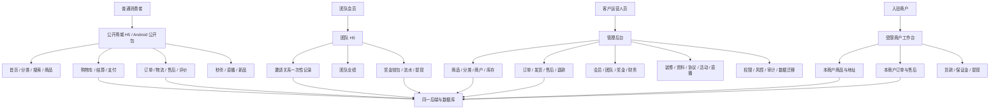
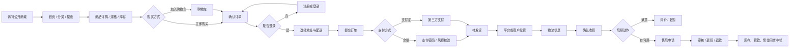
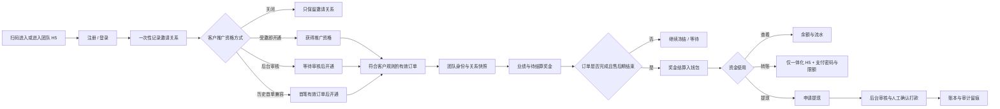
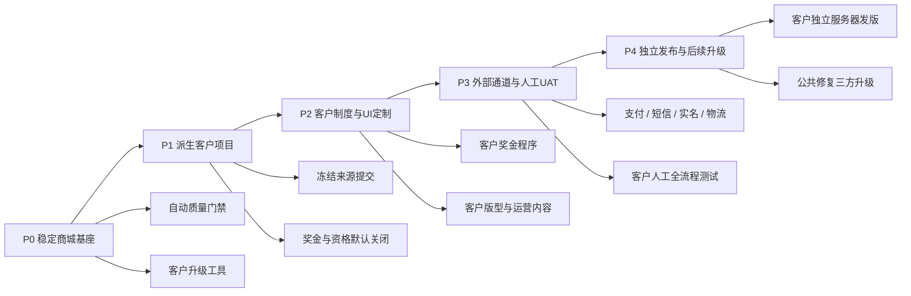

# 灵启商城产品全景、流程与实施规划

更新时间：2026-08-30（Asia/Shanghai）

产品基座：App / 小程序公开商城 + 团队 H5 拆分版（可选一体化 H5）

线上版本：`1.0.100`

本地版本：`1.0.100`（客户交付工具增量待下次版本）

## 一、产品经理结论

本商城不适合只用一张“思维导图”表达。思维导图适合罗列功能，但不能准确表现用户先后步骤、角色交接、功能是否开放、外部依赖和上线优先级。

建议以以下四件套作为长期产品管理基线：

1. **产品全景图**：说明各端、各角色和业务域的边界。
2. **核心业务流程图**：说明消费者、团队会员、平台和商户如何协作。
3. **功能状态矩阵**：区分“已开发、已上线、已开放、待配置、待外部联调、未开发”。
4. **分阶段路线图**：明确先稳定商城基座和客户派生，再完成客户专属制度、外部联调和新渠道。

## 二、状态口径

| 状态 | 定义 | 产品含义 |
| --- | --- | --- |
| 🟢 已上线开放 | 代码、线上版本、入口和基本流程均存在 | 可进入正常运营，但仍需持续观察数据 |
| 🟡 已上线未开放 | 代码已上线，但开关关闭、无有效内容或未对用户展示 | 不应当作“未开发”，需要运营配置后开放 |
| 🔵 已开发待发布 | 已在本地候选版完成并验证，尚未进入线上 | 随下一次受控发版上线 |
| 🟠 待外部条件 | 产品框架已具备，但依赖客户资料、第三方账号、签约、密钥或真实联调 | 条件不齐时不得对外承诺可用 |
| ⚪ 未开发 | 当前没有可交付的正式前端或完整通道 | 必须单独立项、设计、开发和验收 |
| 🟣 可选交付 | 已具备构建或能力，但不是当前线上主入口 | 按客户交付模式启用 |

## 三、产品全景图

### 核心边界

- 公开商城承载普通购物和扫码注册；扫码注册可在同一事务一次性记录邀请关系，但不展示奖金制度，也不开放团队经营、转账或提现入口。
- 团队 H5 只承载团队和资金业务，不作为商品商城入口。
- 邀请关系只记录“谁邀请了谁”，不等于取得推广资格。推广资格由每个客户独立选择关闭、受邀即开通、后台审核或历史首单兼容方式；新客户默认关闭。
- 一体化 H5 是可选交付，不是当前线上主入口；它可以在同一 H5 中同时承载普通商城和团队业务。
- 微信小程序不是当前 H5 的直接构建产物，需要独立前端项目。

## 四、消费者交易主流程

### 当前流程判断

- 浏览、商品、购物车、下单、余额支付、订单、发货、售后、退款、评价的产品链路已开发并上线。
- 支付宝代码链路与原路退款已具备；当前基座客户配置保持关闭，每个新客户必须使用自己的商户参数完成真实资金联调后再开放。
- 微信支付没有正式支付网关实现，不能因为订单字段支持 `WECHAT` 就判断为已完成。
- 物流公司和运单号可正常使用；真实物流节点查询仍依赖客户选择并接入物流服务商。

## 五、团队业务主流程

### 当前流程判断

- 团队 H5、邀请关系、推广资格、业绩、奖金、钱包、提现及后台审核已经上线；余额互转只允许可选一体化 H5，拆分公开商城和团队 H5 不开放互转。
- 具体客户奖金比例、复购规则、释放周期和追回规则必须由客户书面确认；“客户定制”规则未完成前，系统会拒绝相关订单，而不是按占位规则计算。
- 公开商城可记录扫码邀请关系，但普通购物是否开通推广资格、是否计奖完全由客户项目决定；公开端不宣传或展示奖金制度。

## 六、多商户履约与结算流程

```mermaid
flowchart LR
    A[平台创建或商户维护商品] --> B[下架草稿]
    B --> C[提交商户商品审核]
    C --> D{平台审核}
    D -->|驳回| B
    D -->|通过| E[商品上架]
    E --> F[消费者一次结算]
    F --> G[生成支付父交易]
    G --> H[按平台或商户拆分履约子订单]
    H --> I[各销售方独立发货]
    I --> J[各子单独立售后 / 退款]
    J --> K[确认收货 + 售后期结束]
    K --> L[商户货款转为可提现]
    L --> M[商户申请提现]
    M --> N[发票 / 调整 / 风控复核]
    N --> O[平台确认实际打款]
    O --> P[资金总账与操作审计]
```

### 当前流程判断

- 平台自营与多商户商品可一次支付、分子单履约，商品审核、商户隔离、售后、退款、保证金、货款和提现账本已上线。
- 商户使用同一管理后台的受限工作台，不是独立域名的第三套商城后台。
- 实际商户经营仍取决于客户是否录入合格商户资料、保证金、结算条款和在售商品。

## 七、功能状态矩阵

### 7.1 交付端状态

| 产品端 | 技术状态 | 当前线上状态 | 结论 |
| --- | --- | --- | --- |
| 公开商城 H5 | 已开发 | `lingqimall.com` 已上线 | 🟢 已上线开放 |
| 团队 H5 | 已开发 | `www.lingqimall.com` 已上线，登录后使用 | 🟢 已上线开放 |
| 管理后台 | 已开发 | `/admin/` 已上线，按角色权限展示 | 🟢 已上线开放 |
| 一体化 H5 | 已开发、可独立构建 | 当前不是线上主入口 | 🟣 可选交付 |
| Android App | 已有 Capacitor 构建链和测试 APK | 线上发布清单 `published=false`，无公开下载 | 🟡 已开发未开放 |
| 微信小程序 | 仅后端公开接口边界可复用 | 独立小程序前端尚未创建 | ⚪ 未开发 |
| iOS App | 不在当前交付基座中 | 无正式交付物 | ⚪ 未开发 / 待立项 |

### 7.2 消费者与增长功能

| 功能域 | 实施情况 | 当前线上实际状态 | 结论 |
| --- | --- | --- | --- |
| 注册、密码登录、短信登录、找回密码 | 前后端已完成 | 入口已上线；短信真实供应商仍需正式联调证据 | 🟢 主流程上线，短信属🟠外部条件 |
| 首页、分类、搜索、商品详情 | 已完成 | 版型、模块和底部导航可独立配置 | 🟢 已上线开放 |
| 轮播图、公告、首页分类 | 装修后台已完成 | 按客户内容和开关决定是否展示 | 🟢 能力上线，客户配置决定开放 |
| 购物车、结算、地址、运费 | 已完成 | 已上线 | 🟢 已上线开放 |
| 余额支付与支付密码 | 已完成 | 已上线 | 🟢 已上线开放 |
| 支付宝支付与原路退款 | 代码链路已完成 | `alipayEnabled=false` | 🟠 待商户参数和真实小额联调 |
| 微信支付 | 订单模型保留类型，但无正式网关 | 无线上入口 | ⚪ 未开发 / 待客户确认 |
| 订单、发货、确认收货 | 已完成 | 已上线 | 🟢 已上线开放 |
| 售后、退货、退款、库存回补 | 已完成 | 已上线并有完整链路回归 | 🟢 已上线开放 |
| 商品评价 | 已完成 | 前台评价、后台筛选与商户回复均已上线 | 🟢 已上线开放 |
| 秒杀 | 已完成并有总开关 | 新客户默认关闭，客户规则确认后开放 | 🟡 已上线未开放 |
| 复购商城 | 一体化 H5 和后端已完成 | 新客户默认关闭；公开商城按边界不包含 | 🟡 已上线未开放，规则属🟠客户条件 |
| 直播广场、直播间、主播工作台 | 独立页面、预告、预约和开关已完成 | 无真实直播内容时自动隐藏 | 🟢 能力上线，内容属🟠客户条件 |
| 新品速递 | 自动新品、运营精选和独立开关已完成 | 无符合条件商品时自动隐藏 | 🟢 能力上线，内容属🟠客户条件 |
| 品牌文化 | 轮播受控入口、独立页和1～10张详情图已完成 | 按客户开关和图片内容展示 | 🟢 能力上线，内容属🟠客户条件 |
| Android 公开下载 | 测试包和升级机制已完成 | 线上发布清单未发布 | 🟡 已开发未开放 |

### 7.3 团队、商户与后台功能

| 功能域 | 实施情况 | 当前判断 |
| --- | --- | --- |
| 邀请关系与推广资格 | 扫码注册一次绑定；四种资格方式独立配置 | 🟢 已上线，新客户默认安全关闭资格 |
| 团队关系树、移线、业绩、排名 | 已开发上线 | 🟢 已上线开放 |
| 奖金记录、冻结、结算、冲正、追回 | 已开发上线，有订单快照、审计和幂等保护 | 🟢 已上线；客户规则仍需🟠确认 |
| 钱包、提现、审核、打款 | 已开发上线；余额互转只属于可选一体化H5 | 🟢 拆分版不开放互转 |
| 商户、商品审核、父子单、货款、保证金、提现 | 已开发上线 | 🟢 能力上线；实际经营取决于运营数据 |
| 后台装修、品牌、资料、协议、公告 | 四版型、品牌主题、首页模块、独立页面和底栏分组维护 | 🟢 已上线可配置 |
| 直播运营中心 | 直播、预告、预约和关联商品已上线 | 🟡 无主播/直播内容时前台不展示 |
| ERP 配置、推单任务、回调和重试基座 | 后台与任务框架已完成 | 🟠 厂商接口映射未完成前禁止启用 |
| 真实物流轨迹 | 页面和可插拔框架已完成 | 🟠 当前只可靠展示承运商和运单号 |
| 权限、操作日志、财务追溯、数据迁移 | 已开发上线 | 🟢 已上线开放 |
| 平台与商家后台 | 双登录入口、错误入口拦截和商户独立工作台 | 🟢 已上线开放 |
| 客服工单与会员消息 | 三端消息中心、订单/售后工单和后台处理 | 🟢 已上线；外部短信/推送属🟠客户条件 |
| 同规格换货 | 申请、审核、寄回、补发、确认与超时完成 | 🟢 已上线开放 |

## 八、当前基座状态与边界

| 项目 | `1.0.100`现状 | 产品判断 |
| --- | --- | --- |
| 版本身份 | 公开商城、团队H5、管理后台和后端统一为`1.0.100` | 🟢 已发布并验收 |
| 商城全流程 | 注册、邀请、购物、支付、履约、售后、退款、评价、工单、换货均有回归 | 🟢 通用基座完成 |
| 客户奖金 | 基座冻结订单和关系并负责结算、追回与审计；具体公式由客户项目实现 | 🟢 边界完成，🟠规则待客户确认 |
| 客户项目创建 | 从冻结提交派生独立Git项目，新客户奖金和推广资格默认关闭 | 🟢 已发布 |
| 客户项目升级 | 三方预检、冲突停止和来源清单更新工具已完成本地增量 | 🔵 待下次版本发布 |
| 自动质量门禁 | 后端、商城三端、后台、派生/升级工具和私有部署安全检查已接入 | 🔵 待下次版本发布 |
| 外部服务 | 支付宝、短信、实名、通知、物流、ERP、直播均按客户参数启用 | 🟠 不写入基座默认配置 |
| 新渠道 | Android有构建链；微信小程序和iOS尚无正式客户端 | 🟣/⚪ 需独立立项 |

当前没有阻断商城基座继续接单的P0代码缺陷。正式客户上线风险主要来自“客户制度未冻结、客户资料不完整、外部通道未真实联调或人工UAT未通过”，这些必须在客户独立项目内解决，不能靠继续给基座增加默认业务规则规避。

## 九、实施路线图

### P0：稳定商城基座

1. 每次提交自动执行后端、商城三端、管理后台、客户派生/升级和私有部署安全测试。
2. 基座只维护通用交易、履约、资金、安全和可复用UI，不写入任一客户奖金公式。
3. 只有完整回归、候选验签、备份恢复和线上验收通过的提交才能作为客户来源。

### P1：派生客户项目

1. 使用派生工具从明确基座提交生成独立Git项目，禁止手工复制工作区。
2. 新客户默认`CUSTOMER_BONUS_DISABLED`和推广资格`DISABLED`，演示内容保持草稿。
3. 建立客户自己的私有仓库、服务器、数据库、域名、密钥和发布记录。

### P2：客户制度与UI定制

1. 先由客户书面确认奖金、等级、复购、退款追回、风控和资格方式，再开发客户专属程序。
2. 客户从四种首页版型、模块、独立页面和底部导航中选择，并替换品牌与运营内容。
3. 客户制度只返回标准奖金结果，不得绕过基座直接写钱包、订单或退款状态。

### P3：外部通道与人工UAT

1. 客户提供支付、短信、实名、物流、ERP或直播服务商资料后再配置启用。
2. 自动化通过后，由用户按真实角色完成扫码注册、下单、支付、发货、收货、奖金或零奖金、退款、换货和提现测试。
3. App或小程序项目必须另做真机、授权、支付回跳、弱网和版本升级验收。

### P4：独立发布与后续升级

1. 每个客户使用自己的候选包、备份、迁移、回滚和线上验收记录，不复用基座生产目标。
2. 后续公共修复先在基座发布验证，再对客户项目运行升级工具只读预检。
3. 发生冲突时保留客户改动并人工处理；无冲突应用后仍须重新完成自动化和用户人工测试。

## 十、建议的验收与经营指标

### 上线门禁

- 核心流程成功率：注册、登录、下单、支付、发货、售后、退款逐项通过。
- 财务一致性：订单实付、退款、奖金、商户货款、平台归集和账户流水可互相核对。
- 内容完整性：所有公开商品、分类、公告、协议和资质不含测试内容。
- 外部服务：每个启用的支付、短信、物流、ERP、直播服务必须有真实成功和失败样例。
- 权限隔离：普通会员、团队会员、商户、财务、运营和系统管理员分别验收。

### 首月核心指标

- 访问 → 商品详情转化率。
- 商品详情 → 加购率、结算率、支付成功率。
- 支付 → 发货时效、签收时效、售后率、退款率。
- 邀请关系 → 推广资格开通率（按客户确认方式统计，不把普通购物默认计入）。
- 直播观看 → 商品点击 → 支付转化率。
- 商户订单 → 可结算 → 提现完成时长。
- 短信成功率、支付回调成功率、物流轨迹可用率。

## 十一、审查依据

- 当前源码的公开商城、团队 H5、一体化 H5 和管理后台路由。
- 管理后台按运营流程组织的菜单与权限。
- `document/RELEASE_REPORT.md`、`document/APP_H5_SPLIT_ARCHITECTURE.md`、`document/USER_OPERATION_MANUAL.md`、多商户设计和交付验收报告。
- 线上 `version.json` 及公开只读接口：商城首页、业务开关、支付开关、直播列表、新品列表和经营资料。

本文件描述的是 2026-08-30、线上`1.0.100`的产品实施状态，并单独标记尚未发布的客户交付工具增量。后续每次正式开放新功能或新增渠道，应同步更新状态矩阵和路线图，而不是只在发版日志中记录技术改动。
