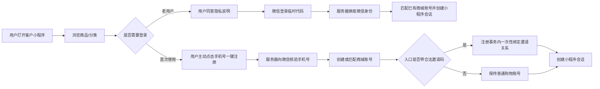

# 微信小程序通用基座与客户定制边界

更新时间：2026-08-30

## 产品结论

微信小程序应当作为商城基座的一种独立公开前端长期维护，微信登录与手机号快捷注册属于所有客户都会用到的通用能力；客户主体、微信账号、支付商户、订阅模板和奖金制度属于客户独立项目，不能写进公共基座。

本次本地候选版只完成“可安全派生的小程序公共底座”，不代表任何客户的小程序已经通过微信审核或可以正式收款。

## 当前流程

- 邀请关系只记录“谁邀请了谁”，不会在公开小程序展示奖金或自动宣传推广收益。
- 已经绑定的微信身份再次登录不重复索取手机号。
- 微信临时登录码和手机号授权码只交给服务器使用；`session_key`、AppSecret、OpenID、UnionID均不返回前端。
- OpenID、UnionID在数据库中加密保存，并使用不可逆摘要进行精确查找。

## 能力归属

| 能力 | 公共基座 | 客户独立项目 |
| --- | --- | --- |
| 原生小程序页面与网络层 | 统一维护 | 选择品牌和客户UI增量 |
| 微信登录、手机号快捷注册 | 统一流程和安全规则 | 提供自己的AppID/AppSecret并联调 |
| 扫码邀请码 | 统一解析，首次注册事务内一次绑定 | 决定推广资格方式和客户制度 |
| 商品、购物车、订单读取 | 复用商城公共接口 | 配置真实商品、库存、运费和售后资料 |
| 微信支付/退款 | 只保留安全关闭状态 | 每客户独立商户号、证书、回调和资金验收 |
| 订阅消息 | 只保留关闭状态 | 每客户独立模板、场景授权和送达验收 |
| 奖金、等级、复购、报单 | 不写进公开小程序，不固定公式 | 每个客户单独开发、测试和部署 |
| 发布 | 不使用基座测试AppID发布 | 每客户独立备案、审核、版本和服务器 |

## 当前已完成

- 独立原生小程序工程：主页、分类、商品详情、购物车、登录、个人中心、订单列表。
- 微信服务端登录、手机号核验、账号创建/匹配、加密身份映射和隐私同意审计。
- 老用户免重复手机号授权；新用户必须主动点击微信手机号授权，拒绝时不会注册。
- 邀请码随扫码入口暂存，只在首次注册时一次性处理；普通入口不会凭空绑定上级。
- 客户级总开关、手机号开关、配置完整性检查、独立限流、敏感响应禁止缓存。
- 客户项目派生时自动保留小程序源码并重置为不可发布的安全地址。
- 新增第31项幂等数据库迁移，只增加微信身份映射表。

## 当前故意未开放

- 微信支付、退款、分账和订阅消息没有冒充完成，运行时明确返回关闭。
- 小程序结算不会创建无法付款的订单；客户支付联调完成后再接通提交订单。
- 没有把基座生产AppID、AppSecret、商户号、证书或真实域名写入仓库。
- 没有把团队中心、奖金说明、提现或余额互转放进公开小程序。

## 客户上线资料与验收

客户至少需要提供：已认证的小程序主体与AppID、管理员协作权限、备案和类目资料、隐私政策、HTTPS业务域名；若要收款，还需自己的微信支付商户号、API v3密钥、平台证书/公钥和回调域名。

正式交付前必须在微信开发者工具和真实手机验证：同意/拒绝隐私、同意/拒绝手机号、老账号匹配、新账号注册、重复登录、扫码邀请、登录失效、弱网、商品/库存变化；支付接入后还要验证真实小额支付、回调验签、重复通知、关单和退款。微信后台审核、备案和真机UAT不能用本地自动化替代。
