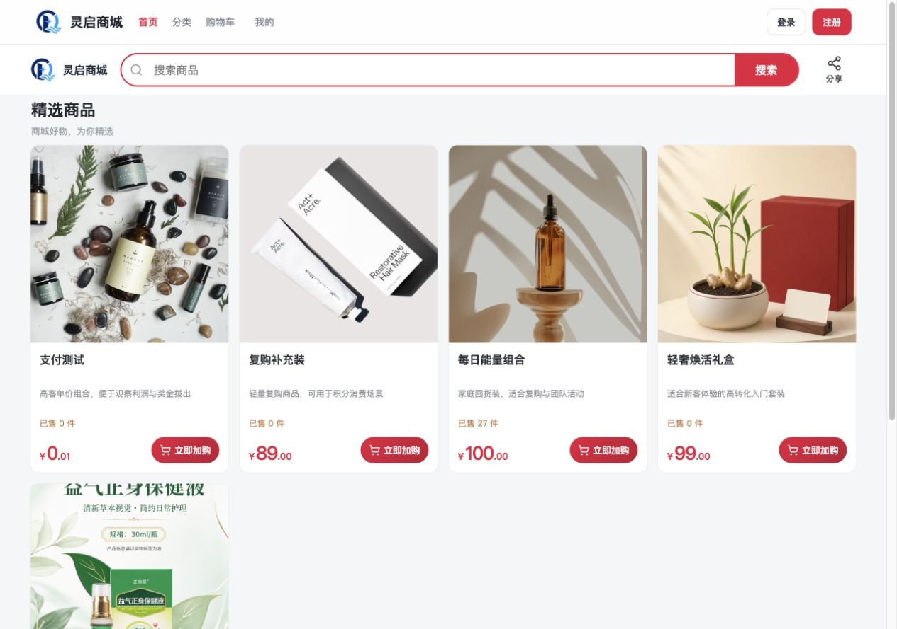
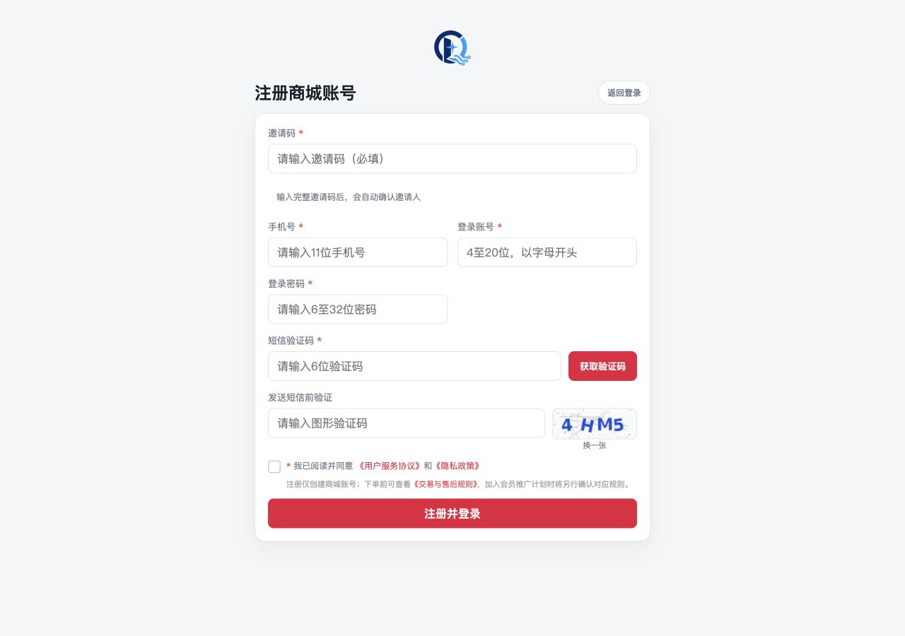
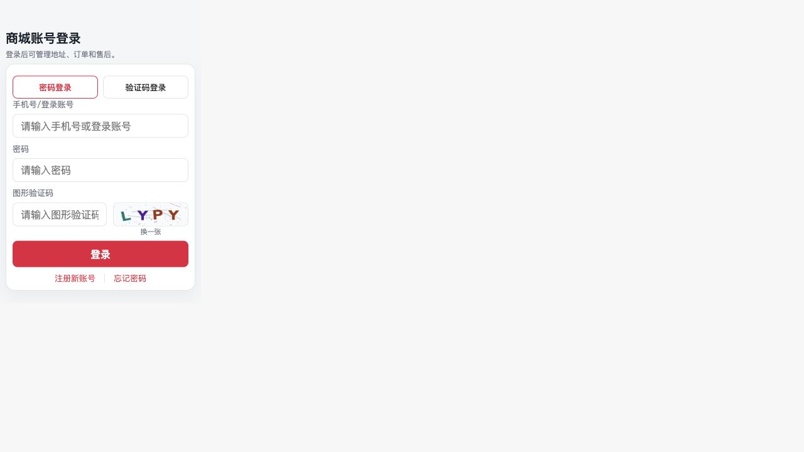
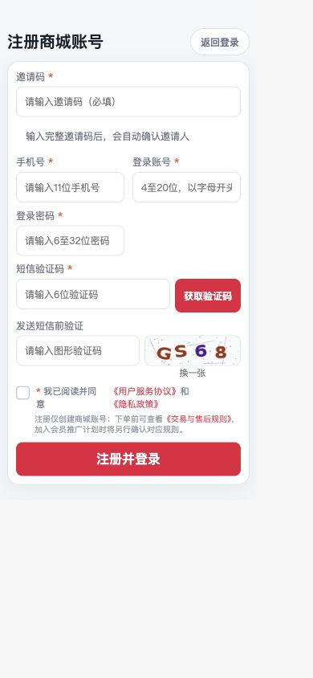

# 2026-08-16 安全修复与全链路复验报告

## 1. 结论与边界

- 本轮确认的 9 项代码缺陷已修复，2 项生产加固建议已在当前测试服务器落地。
- 后端 275/275、商城 63/63、管理后台 80/80 回归通过，后端打包和两端生产构建通过。
- 商城与后台依赖使用官方 npm 源审计，结果均为 0 个已知漏洞；后端 208 个运行时依赖经 OSV 批量复核，当前未命中已知漏洞。
- 本轮没有发布新的商城程序、没有执行数据库迁移、没有修改会员、订单、奖金或资金数据。线上程序仍为 1.0.55；本地修复归入 1.0.56 待发布版本。
- 当前结论不等同于真实支付宝、真实短信、真实物流供应商或客户复购制度验收，这些项目需要外部账户、凭证或客户规则才能完成最终验收。

## 2. 已修复问题

| 风险 | 问题 | 修复结果 | 主要代码位置 | 验证 |
| --- | --- | --- | --- | --- |
| 高 | 同一短信验证码在并发请求中可能被重复使用 | 用 Redis Lua 在一次原子操作中完成读取、比对和删除；并发正确请求最多成功一次 | `SmsVerificationServiceImpl` | 短信验证码并发、错误次数和过期测试通过 |
| 高 | 支付密码正确请求可能与并发错误请求竞争，绕过刚形成的锁定 | 清除错误计数失败时重新读取会员锁定状态，若已锁定则拒绝资金操作 | `ShopWalletServiceImpl` | `PaymentPasswordLockRaceTest` 通过 |
| 高 | 同一会员并发下单可能同时通过限购快照 | 下单开始即锁定会员行，同一会员订单校验串行执行，库存原子扣减规则保持不变 | `ShopServiceImpl` | 并发限购回归通过 |
| 高 | 只有会员管理权限的后台账号可能在新增会员时同时开通代理或指定等级 | 开通分销或指定等级必须额外具有 `distribution:manage` | `ShopController` | `AdminSensitiveOperationControllerTest` 通过 |
| 中 | 批量导入接口信任客户端传入的操作人编号和姓名 | 审计操作人统一从当前后台登录会话读取，客户端字段不再作为可信来源 | `ImportController` | 控制器权限与后台全量回归通过 |
| 中 | 后台不存在账号与存在账号的密码校验耗时有差异 | 不存在账号也执行一次等价 BCrypt 校验，统一错误口径继续保留 | `AdminAuthServiceImpl` | 后台认证回归通过 |
| 中 | 使用会变化的会话令牌参与幂等指纹，令牌刷新后相同请求号可能失去保护 | 登录过滤器把稳定会员编号绑定到请求，幂等指纹优先使用稳定身份 | `IdempotentAspect`、`ShopSessionCookieFilter` | 公共模块和登录过滤器测试通过 |
| 中 | 基础配置存在数据库账号和密码默认值，误用环境时可能带弱配置启动 | 基础及本地配置改为必须显式提供数据库账号密码；生产启动拒绝 root 和已知弱口令 | `application.yml`、`application-local.yml`、`ProductionSafetyGuard` | 生产安全配置测试通过 |
| 中 | 仓库仍保留一份已经被安全私有部署流程替代的旧 Compose 环境文件 | 删除旧文件，客户部署只允许使用现有的强制预检、内部网络和最小密钥部署入口 | `document/docker/docker-compose-env.yml`（已删除） | 部署入口和仓库引用复核通过 |
| 中 | 前后端及后端传递依赖存在过期组件 | 升级 Spring Boot、Spring Cloud、Spring Data、Jackson、Netty、HTTP Client、Log4j、POI、dom4j 和 Bouncy Castle，移除支付宝 SDK 带入的旧组件 | 根 `pom.xml`、`mall-distribution/pom.xml`、两端锁文件 | npm 官方审计 0；OSV 208 项 0；依赖树确认旧组件已移除 |

### 2.1 再次复核、未发现新增漏洞的控制

- **CSRF**：后台 Cookie 为 `HttpOnly + Secure + SameSite=Strict`；商城为兼容原生 App 使用 `SameSite=None`，但所有 Cookie 身份的写请求必须带浏览器普通跨站表单无法设置的 `X-Shop-Client: storefront`，后台写请求同样必须带 `X-Admin-Client: admin-web`。生产跨域未开放任意来源，因此不属于“只依赖 Cookie、任意跨站请求可写”的缺失状态。
- **SQL 注入与命令注入**：本轮重新检查外部入参到 Mapper、批量导入、搜索排序和脚本调用边界，没有发现新增可控 SQL 结构拼接或把请求参数传入系统命令的可达链路。
- **XSS 与外链**：商城文本继续由 Vue 转义输出，轮播外链只接受 HTTPS，Nginx CSP 禁止外部脚本、对象和非支付宝表单提交；本轮浏览器控制台未发现 CSP 或运行错误。
- **文件上传和路径穿越**：售后图片仍执行真实图片解析、大小/数量限制、随机文件名和会员私密目录隔离；Excel 导入不使用客户端文件名作为服务器路径。
- **订单与支付篡改**：售价、优惠、PV、奖金、库存和退款累计金额继续由服务端订单与商品数据计算；支付回调验签、稳定业务编号、数据库状态机和持久化幂等控制均保留，本轮资金与奖金回归无失败。

## 3. 两项生产加固

### 3.1 后端非 root 运行

- 新增受限的 `lingqimall` 系统用户运行后端，程序包和生产配置只读。
- systemd 启用 `NoNewPrivileges`、`ProtectSystem=strict`、私有临时目录和设备、空能力集合，只允许写上传和日志目录。
- 服务器实测服务为 `active`，Java 进程用户为 `lingqimall`，健康状态为 `UP`。
- 首次切换时发现历史日志路径 `/var/logs/spring.log` 未加入可写目录，服务启动失败；验收过程立即捕获并补齐目录与权限后重新切换成功。期间未执行数据库写入、未丢失业务数据，最终服务已恢复并持续健康。

### 3.2 自动备份与恢复准备

- 安装并启用每日自动完整备份定时器，备份服务使用严格 systemd 沙箱和最小必要文件能力。
- 2026-08-16 生成的新备份已通过 SHA-256、gzip、tar 内容和 `MANIFEST` 应用健康清单校验。
- 备份包含数据库、程序、上传文件、关键配置、Nginx、systemd 服务及备份脚本，避免只备份数据库而遗漏运行环境。
- 未在生产数据库上执行破坏性的覆盖恢复。正式交付前仍应在隔离服务器做一次“恢复到新实例”的演练，验证的不只是压缩包可读，还包括应用能正常启动和账务数据一致。

## 4. 服务器只读复验

- 后端、Nginx、MySQL、Redis 均为运行状态；后端健康为 `UP`。
- 公网 `/api/actuator` 与 `/api/actuator/health` 均返回 404；Swagger 和接口文档继续屏蔽。
- 后端只监听服务器本机地址，Nginx 是唯一公网 API 入口；生产配置和密钥文件权限未放宽。
- 本轮只替换了 systemd、Nginx 精确拦截和备份配置，没有替换线上 JAR 或前后台静态资源。

## 5. 页面与业务流程复验

### 5.1 首页和商品浏览

首页、分类、搜索、商品详情、价格、规格和库存展示正常，浏览器控制台无错误；公开商品响应未显示成本价、BV、安全库存、发货地址、内部地址编号或复购配置。

### 5.2 注册与登录

注册页进入后会自动加载真实图形验证码，协议控件、输入标签和键盘操作语义继续保留。电脑端表单宽度已收紧，避免标题、表单和验证码横向过度分散。

### 5.3 未登录权限拦截

购物车、个人中心、邀请、秒杀和复购入口在未登录时都会跳转登录页并保留返回地址。“拦截”表示这些页面不能匿名查看会员数据或发起会员业务，并不是购物车功能失效。

### 5.4 手机端适配

手机端首页和注册页无横向溢出，底部导航、商品卡片、登录入口、验证码和协议区域均可见可操作。

## 6. 尚需外部条件完成的验收

这些项目不是本轮仍已知可直接修复的代码漏洞，而是缺少真实外部条件：

1. **真实资金**：支付宝真实支付、退款、提现到账及银行/支付宝对账仍需使用真实商户账户小额验收；本轮只完成钱包、退款、幂等、奖金、欠款和状态机自动化回归。
2. **真实短信**：验证码一次性消费和限流已通过自动化测试，但真实短信送达、签名和模板需在客户短信账号配置后验收。
3. **真实物流/ERP**：已有可插拔轨迹接口、发货、拆包/合包及 ERP 重试框架；快递公司真实扫描节点和 ERP 回调需取得客户服务商文档及凭证后验收。
4. **秒杀压测**：库存、限购、重复下单和数据库兜底已测试；正式活动上线前仍需在隔离压测环境使用预期峰值并发跑写入压测，禁止直接对生产做压力测试。
5. **复购结算**：普通、秒杀、复购订单已隔离，客户定制奖金模式默认禁止下单；客户确认制度、准入、退款和结算口径后再实现并专项验收。
6. **恢复演练**：当前备份包内容和哈希有效；应在隔离实例完成一次全量恢复演练，不能在现有生产库上用覆盖方式试验。
7. **微信支付**：当前不是已交付能力。若客户明确需要公众号/H5 微信支付，需先取得微信商户号、AppID、证书和回调域名后开发验收。

## 7. 发布建议

- 本地版本定为 1.0.56，状态为待发布；线上应用继续是 1.0.55。
- 发布 1.0.56 时按现有发布门禁执行：发布前完整备份、构建身份与哈希、数据库迁移计划、核心数据计数、服务健康、公开字段、未登录后台、Actuator、启动日志和发布后回归。
- 本轮没有数据库结构迁移；不得重复清理或重造用户保留的奖金测试数据。
