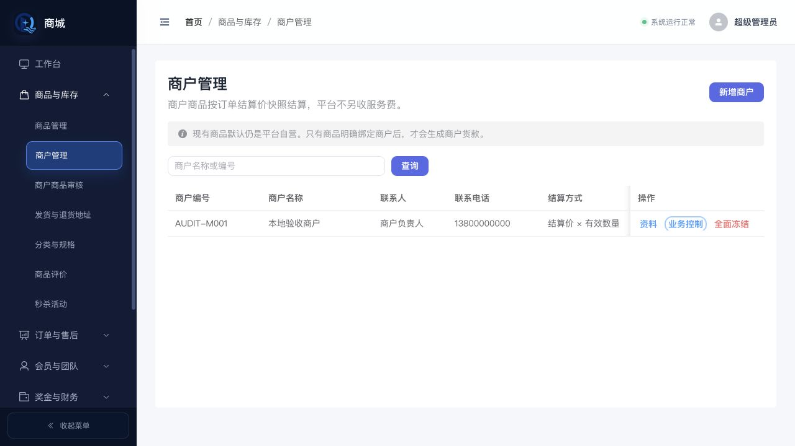
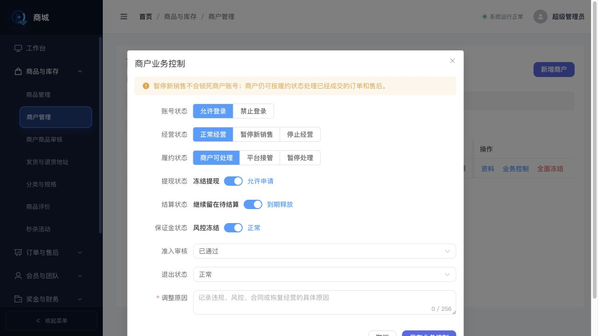
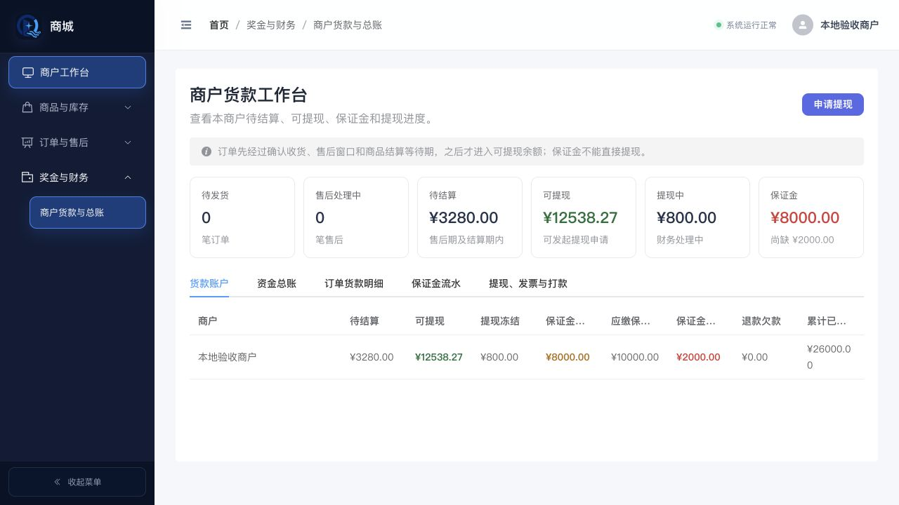
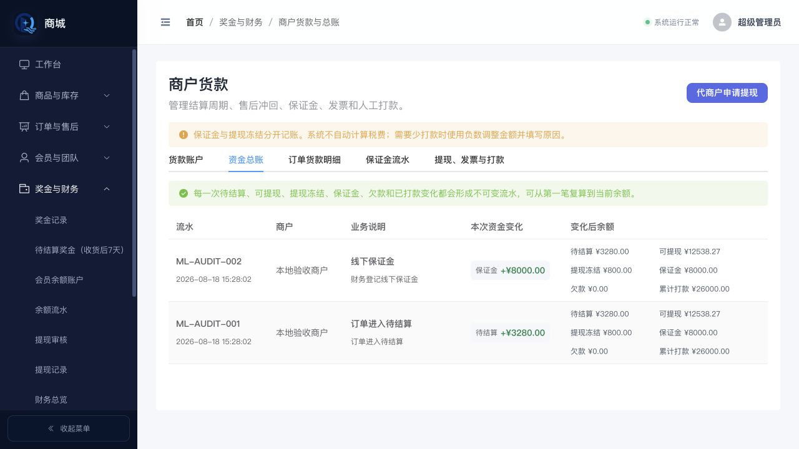

# 多商户平台与商户工作台验收报告

验收日期：2026-08-18
范围：本地代码与本地测试环境，不访问线上、不产生真实交易或资金写入。

## 验收步骤与结论

1. 以平台管理员身份进入后台，确认商户管理和商户货款入口已出现在清晰的业务菜单中。
2. 检查商户列表，确认不再只显示“启用/停用”，而是分别展示经营、履约、提现、结算、审核和退出状态。
3. 打开业务控制，确认暂停新销售时不会自动禁止登录，也不会阻止历史订单和售后履约。
4. 以商户身份进入后台，确认首页落在商户货款工作台，菜单不出现平台会员、团队、奖金规则和全平台数据。
5. 检查商户资金卡片，确认待结算、可提现、提现中、保证金和保证金缺口口径分开。
6. 检查资金总账，确认每笔变化同时展示本次增减和变化后余额，并包含保证金、欠款与累计打款。
7. 使用后端回归测试验证商户 A 不能查询商户 B 的订单，前端传入其他 merchantId 不扩大查询范围。
8. 暂停商户经营后验证未支付订单不能继续支付，商户账号仍可进入自己的订单和售后工作区。
9. 以商户 A 会话直接请求商户 B 的订单、售后、资金和售后私密凭证，后端均按会话 `merchant_id` 拒绝，不依赖菜单隐藏或前端传参。

## 发现并已修正的问题

- 商户默认账号原本缺少订单和售后权限，会导致“保留履约”只有状态定义、没有实际操作入口。已补齐默认权限并保留后端商户范围过滤。
- 商户恢复会话时可能短暂进入平台看板并触发无权限提示。已把商户默认首页和恢复路由统一到商户货款工作台。
- 平台菜单原本没有商户管理和商户货款固定入口。已分别加入“商品与库存”和“奖金与财务”。
- 资金总账原本把各余额字段平铺成大量横向列，右侧内容难以阅读，且没有直观展示累计打款变化。已合并为“流水、业务说明、本次资金变化、变化后余额”。
- 商户工作台原本只能看到资金表格，无法第一眼判断待发货、售后和保证金缺口。已增加六张经营摘要卡。
- 售后凭证读取原本只依赖会员编号和随机文件名，商户若获得另一商户的完整路径仍可能读取。现已在返回文件前核对租户、会话商户、会员和售后单中的精确文件引用，并增加越权回归测试。

## 视觉证据

平台商户管理：

商户多维业务控制：

商户专属工作台：

平台商户资金总账：

## 尚未作为缺陷处理的产品边界

当前仍禁止不同商户商品一次合并结算。这是为了在“交易主单 + 商户子单”完成前，避免单次支付、分商户运费、部分发货、部分售后和退款总额出现不一致。父子订单的正式演进方案见 `document/MULTI_MERCHANT_ARCHITECTURE.md`。
