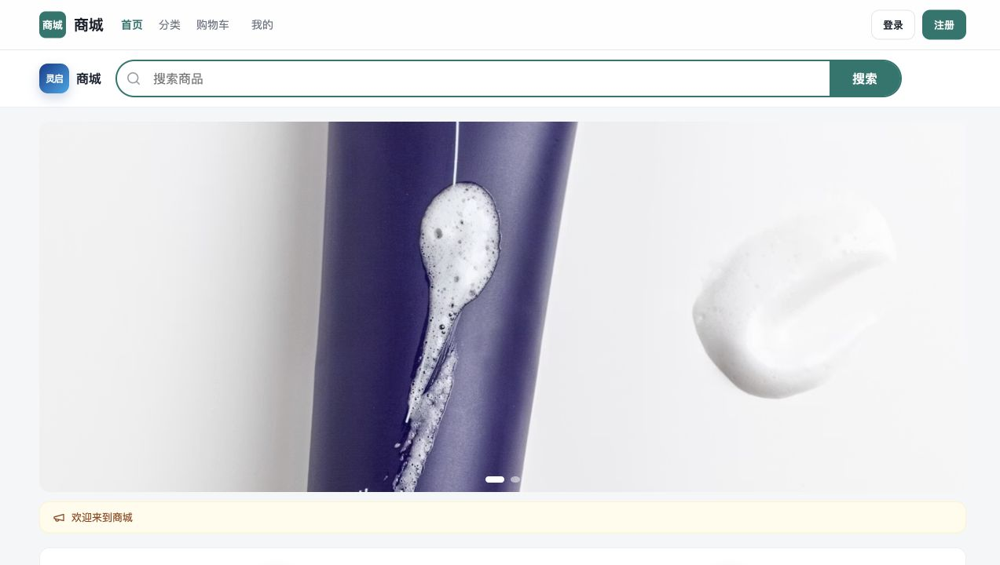
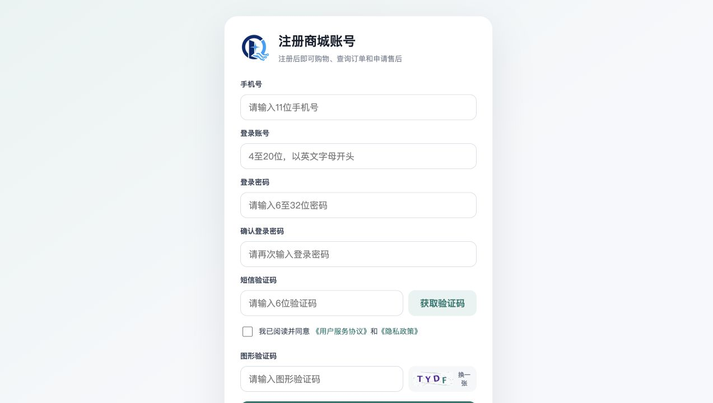
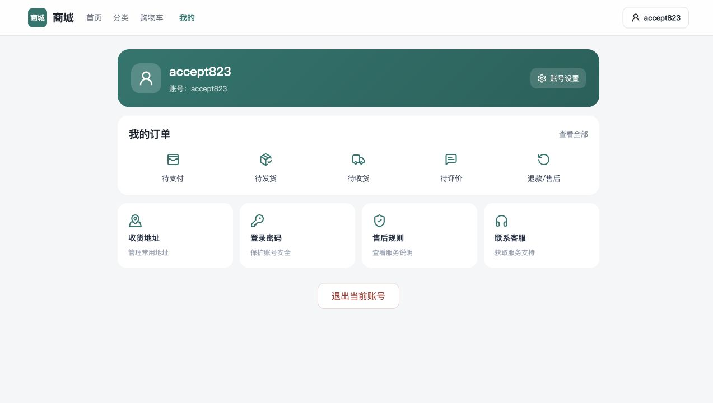
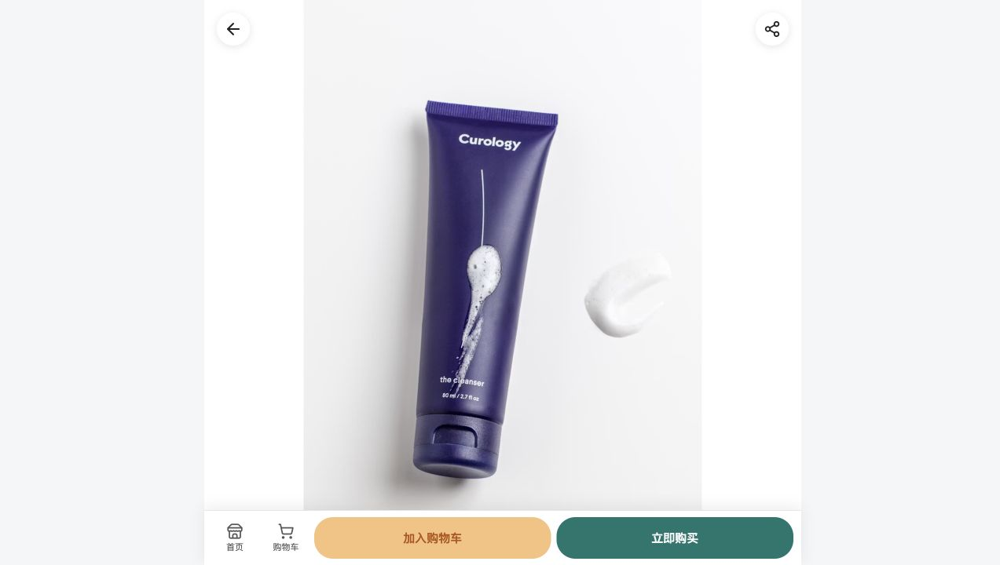
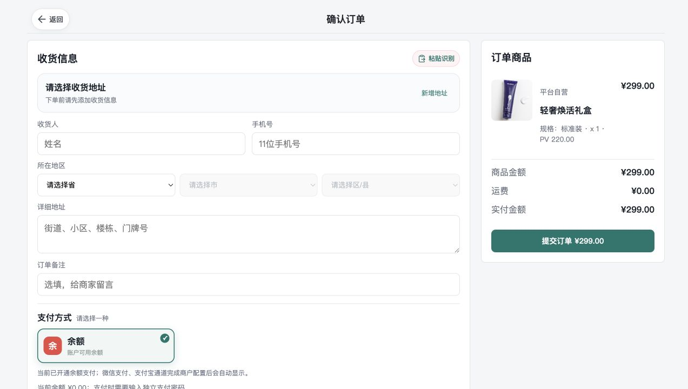
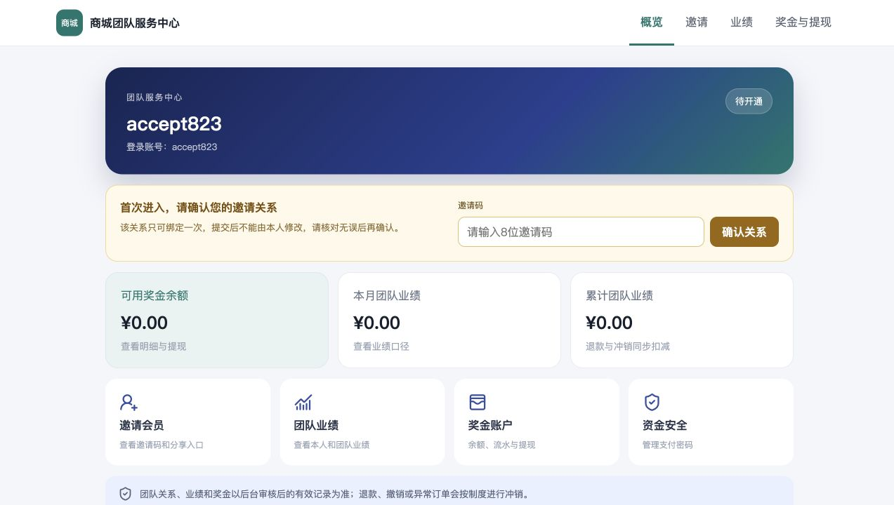
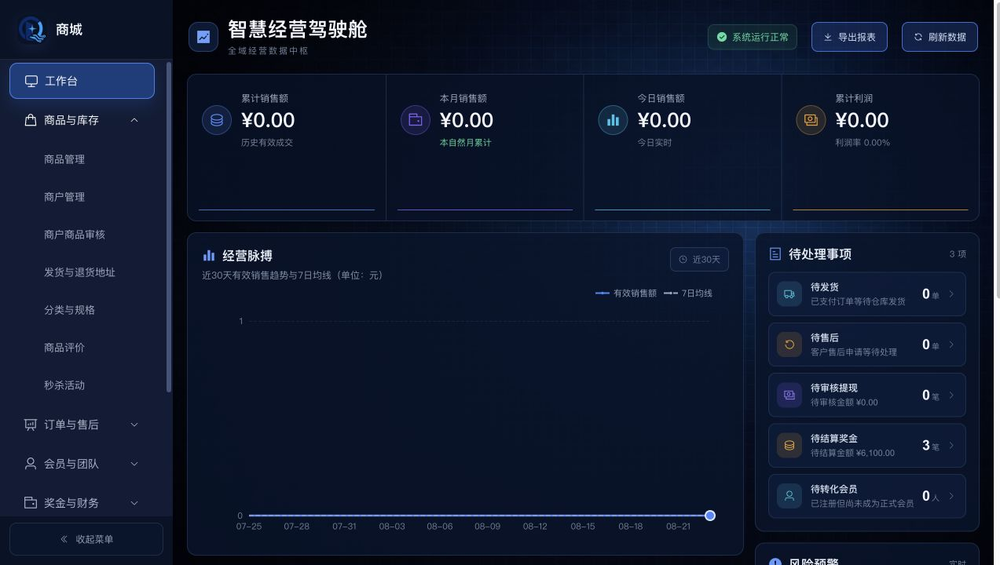

# 1.0.75 稳定性验收、复杂度收敛与正式交付门禁报告

日期：2026-08-23（Asia/Shanghai）

对象：App / 小程序公开商城 + 团队 H5 拆分基座（含可选一体化 H5 构建）

验收版本：`1.0.75`（本地待发布）

线上版本：`1.0.74`（本轮未访问、未修改、未发布）

## 一、结论

`1.0.75` 已从“持续找问题”切换到“交付门禁”管理。本轮只处理可复现缺陷，未按理论性扫描建议继续扩张架构。

当前代码候选版通过以下门禁：

1. 注册、绑定团队、设置支付密码、余额下单、发货、客服备注、确认收货、奖金生成与结算、提现审核与打款、退货退款、库存回补、资金冲销的服务级完整链路。
2. 公开商城、团队 H5、一体化 H5 和管理后台的真实浏览器页面检查。
3. 支付回调、迟到支付退款、重复通知、余额、退款、奖金批量回滚、秒杀库存和商户结算等并发/幂等专项。
4. 后端、商城和管理后台的全量自动化回归及全部生产构建。
5. 客户私有部署配置与安全工作流校验。

因此，代码可进入客户交付前的最后阶段：客户资料配置、真实支付宝/短信/物流或 ERP 联调、客户规则确认和人工 UAT。上述外部条件不应伪装成已验收通过。

## 二、门禁结果

| 门禁 | 结果 | 证据 |
| --- | --- | --- |
| G0 版本与范围冻结 | 通过 | 本地 `1.0.75`，线上仍为 `1.0.74`；只维护拆分基座 |
| G1 后端全量回归 | 通过 | 442/442，失败 0、错误 0、跳过 0 |
| G2 完整业务链路 | 通过 | `DeliveryStabilityAcceptanceTest` 使用独立 H2，1/1 |
| G3 并发与幂等专项 | 通过 | 53/53，覆盖支付、退款、钱包、奖金、秒杀和商户结算 |
| G4 前端回归与构建 | 通过 | 商城 74/74；后台 110/110；四份生产构建成功 |
| G5 页面与流程验收 | 通过 | 公开商城、注册、个人中心、商品、结算、团队 H5、后台工作台均正常 |
| G6 私有部署门禁 | 通过 | Compose 校验 9/9；部署安全工作流通过 |
| G7 外部真实服务 | 待客户条件 | 真实支付宝、短信、物流/ERP、微信支付及客户复购制度 |

## 三、本轮确认并修复的真实问题

### 1. 全额退货退款订单可能没有正确关闭

- 触发条件：已发货订单完整退货，商家确认收到退货并执行全额退款。
- 根因：关闭订单时只统计“退款完成”状态，遗漏了退款流程中当前有效的确认状态，导致全额退款数量判断偏小。
- 修复：统一全额退款数量的有效状态口径，并由完整链路测试验证订单关闭、余额原路退回、库存只回补一次、资金归集冲销和财务退款单各自一致。

### 2. 测试环境定时任务干扰验收并制造 Redis 噪声

- 触发条件：完整 Spring 测试上下文启动时，定时任务与测试同时运行。
- 影响：产生非业务错误日志，并可能让测试结果受时序影响。
- 修复：所有定时任务统一支持 `app.scheduling.enabled` 开关，生产默认启用，测试明确关闭；测试日志从 DEBUG 收口为 INFO。

### 3. 交付验收测试最初污染共享测试数据

- 触发条件：新完整链路用例与历史测试共用 `testdb`。
- 影响：第一次全量运行准确暴露 11 个被新增会员/订单影响的旧测试，不涉及商城业务或线上数据。
- 修复：完整链路用例改用独立 H2 数据库；修复后重新执行全量回归并通过。

## 四、复杂度收敛

1. 私有部署模板删除已经没有运行代码使用的 Sa-Token JWT、超时和活跃超时变量。
2. 同步删除环境生成、部署前检查、Compose 校验及测试中的对应死配置。
3. 未删除仍在业务运行的旧表、权限或兼容路径；没有为了扫描报告而重写资金锁、租户边界或状态机。
4. 浏览器中一个旧测试 Cookie 导致本地域名出现 401，经干净域名复验登录与工作台完全正常；诊断性代码已撤回，没有将环境假象固化进产品。

## 五、完整链路核对口径

```text
公开注册
→ 团队 H5 绑定邀请关系
→ 设置支付密码
→ 管理端增加隔离测试余额
→ 创建订单并余额支付
→ 后台发货并记录客服备注
→ 用户确认收货
→ 生成奖金快照
→ 售后期结束后结算奖金与产品成本/剩余货款
→ 奖金进入邀请人钱包
→ 提现申请、审核、打款
→ 第二笔订单发货、收货、申请退货
→ 商家审核、用户填写退货物流、商家确认收货退款
→ 核对订单关闭、余额退回、库存回补、奖金/货款冲销和财务退款记录
```

资金核对采用服务端权威金额，验证重复结算不重复入账、退款不重复回补库存、已退款订单的归集金额归零。

## 六、页面与产品流程证据

1. 公开首页：主导航、商品入口、品牌与合规入口正常。

   
2. 注册：账号、密码、短信与协议步骤完整。

   
3. 个人中心：订单、钱包与账户入口按公开包边界展示。

   
4. 商品详情：规格、数量、库存、加购与立即购买入口正常。

   
5. 结算：收货地址、商品、订单备注和支付方式链路完整。

   
6. 团队 H5：团队与结算能力保留在独立入口，未泄露到公开 App / 小程序包。

   
7. 管理后台：登录、权限菜单、经营指标、待办和图表加载正常。

   

## 七、正式交付前仍需外部确认的内容

以下不是当前代码 Bug，必须在具体客户和真实服务资料具备后验收：

1. 客户经营主体、协议、品牌、域名、备案和资质内容。
2. 支付宝真实小额支付、重复通知、退款到账与财务对账。
3. 短信供应商签名、模板、频率和失败回执。
4. 物流轨迹服务商或客户 ERP 的授权资料、回调白名单和真实单号。
5. 微信支付是否纳入客户范围。
6. 复购制度、奖金参数、结算周期和商户风险规则的客户签字确认。
7. 客户人员按注册到售后的 UAT，并由财务核对奖金、提现和退款样例。

## 八、交付判断标准

代码层面已经达到“可配置、可验收的专业商城基座”状态；正式交付不能用“没有发现任何 Bug”表述，而应满足：

- 本报告 G0～G6 持续通过；
- G7 外部真实服务与客户规则完成；
- 客户 UAT 缺陷清零或有书面接受；
- 发布前完成备份、迁移预检、版本核对和发布后验收；
- 交付后只进入受控缺陷修复和客户需求迭代，不再进行无边界理论整改。
