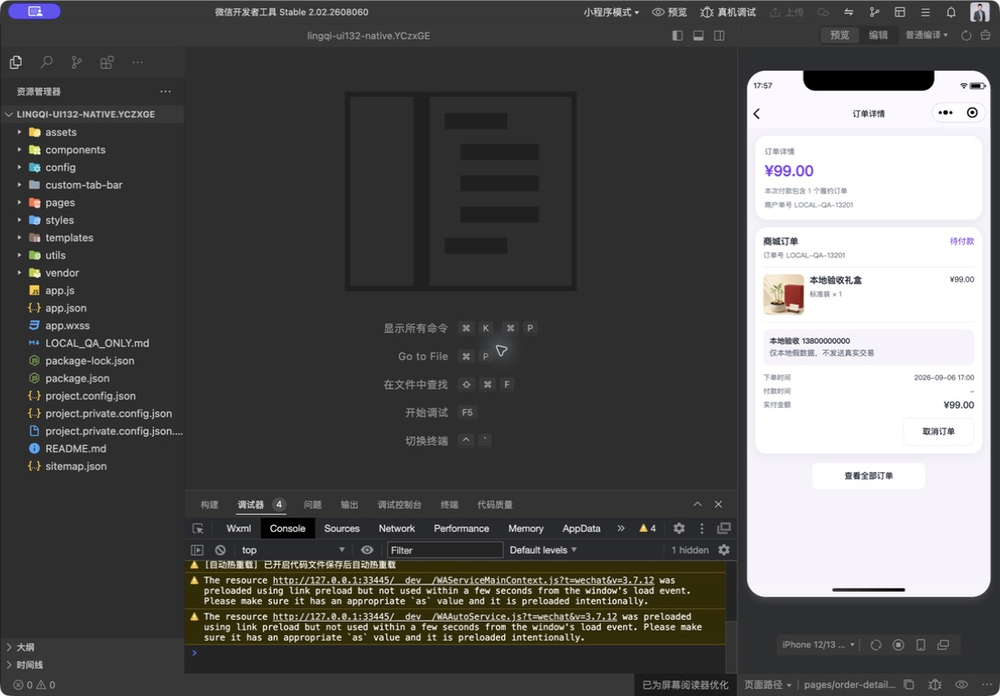
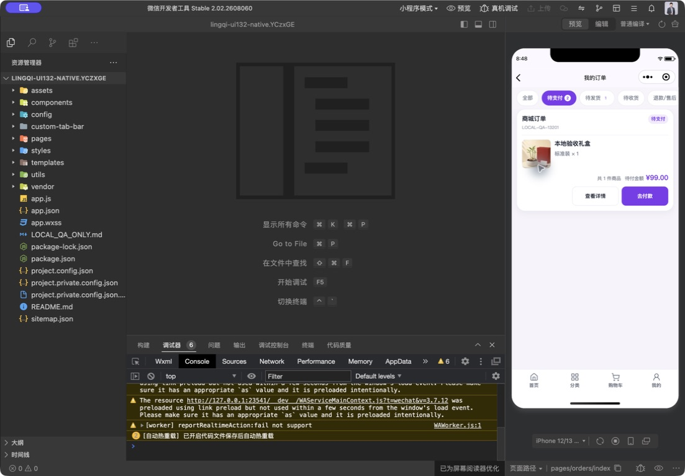
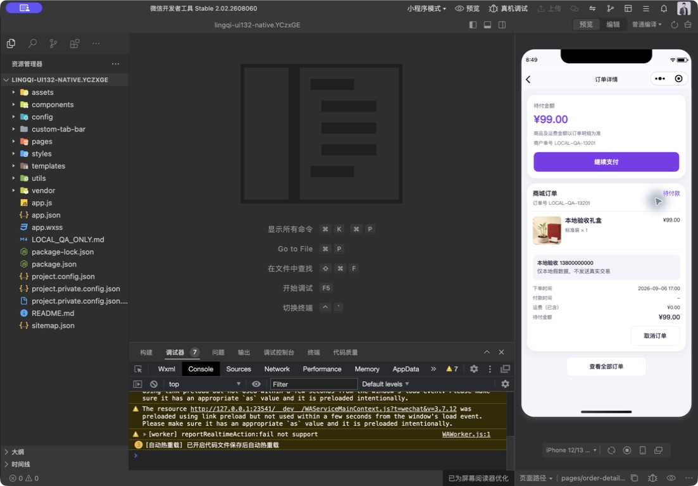
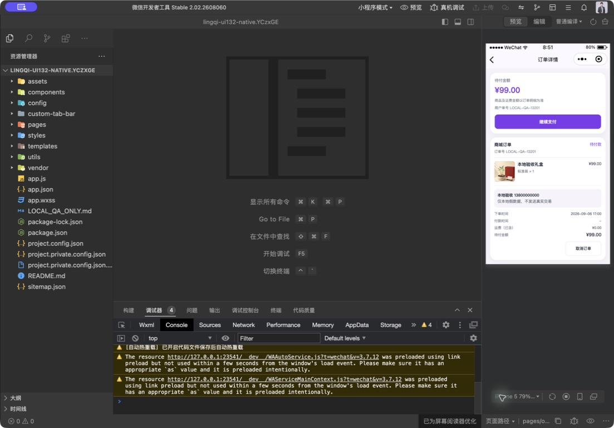
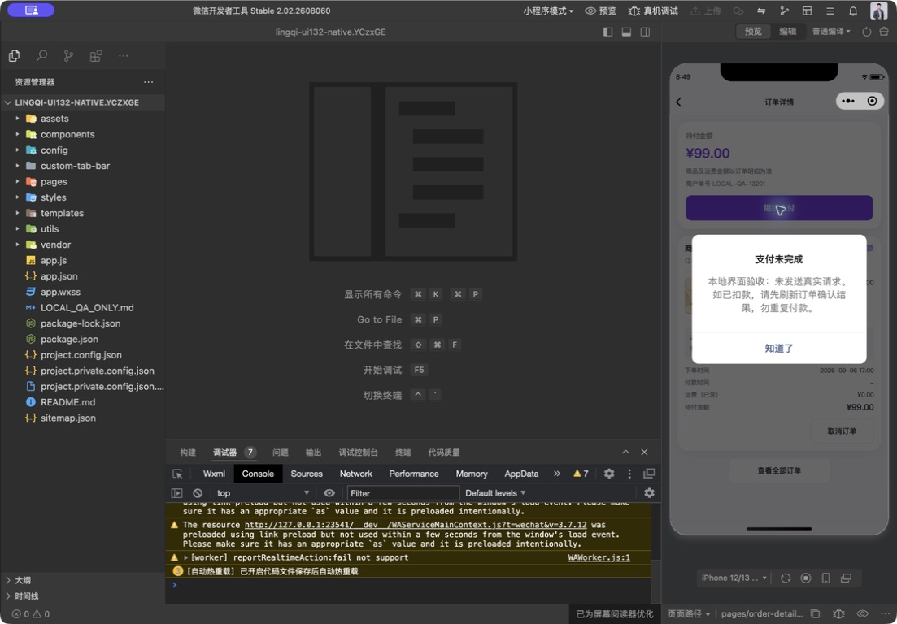
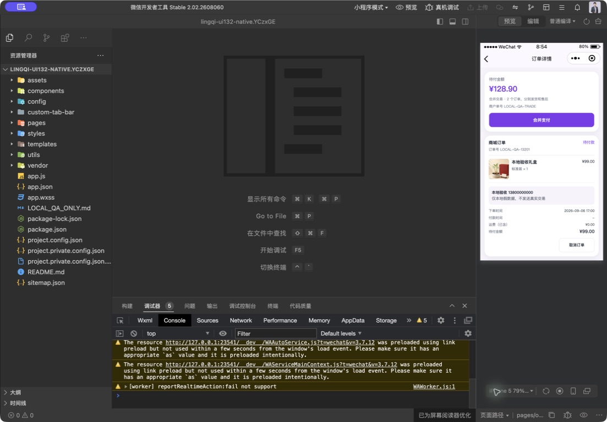
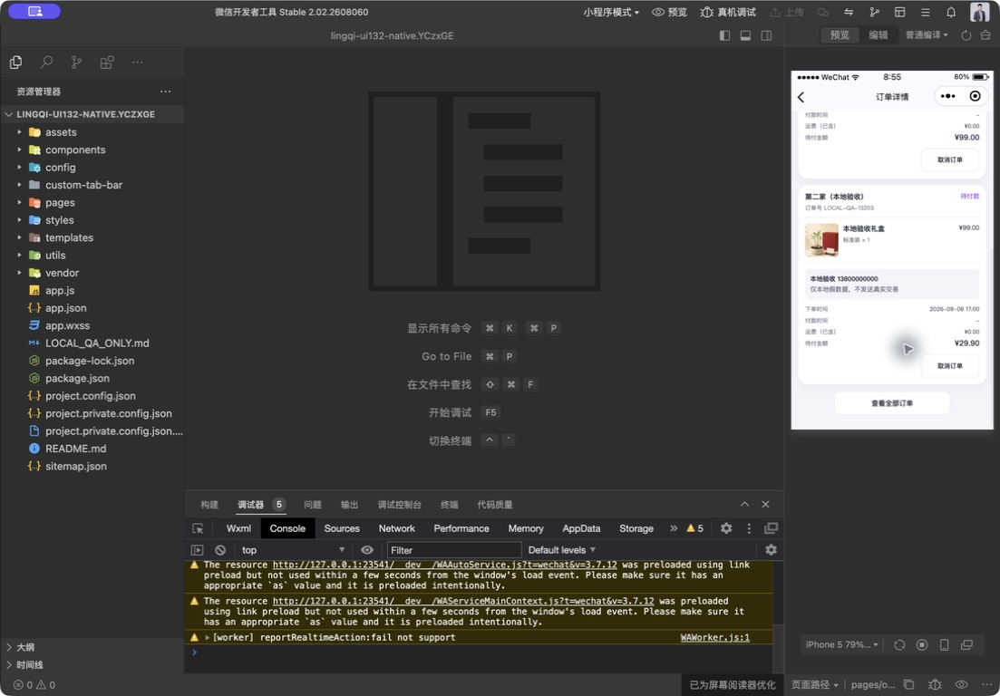

# MC07 订单恢复：H5功能对照与原生验收

本轮9月6日开始，用户中断后于2026-09-07继续；基线ab8f76e6，本地1.0.132候选。Product Design audit用于截图核对实际入口/文案；源码对照不冒充整个产品视觉审查。

## 范围及复现

客户目标：从待付款订单继续付款，先明确本次总额，取消/异常后能找回原单。H5 `OrderDetailView.vue`已有待付款操作，但微信原生不复制支付宝网页表单或余额密码流程。

修复前原生390：待付款订单顶部仍显示“本次付款包含1个履约订单”，底部“实付金额”，只有取消按钮。结构已有清晰商品、收货和状态区，但入口缺失、付款含义误导，属于交易恢复问题，不只是颜色差异。

## 实际步骤与结果

1. **待付款列表 → 去付款：通过（隔离原生390）。** 当前金额标为待付；进入同一订单详情，未发起支付或创建新业务订单。

2. **核对详情 → 继续支付：显示通过（隔离原生390、320）。** 顶部为待付金额及唯一主要支付按钮；商品、运费、取消保留；常规字号下不溢出，320底部内容可继续滚动。通过功能回归验证单单/合并单、零元不回退原价、金额变更暂停。

3. **本地模拟请求拒绝 → 中央确认弹窗：通过（隔离原生390）。** 明确支付未完成，提醒若已扣款先刷新核对；确认后仍保留订单，不以页面底部小字代替主要提示。

4. **待付款子单 → 完整合并订单：显示通过（隔离原生320）。** 顶部128.90元、单一“合并支付”，滚动可见99.00和29.90元两张待付款子单；不是用99.00元的子单标题暗示整笔交易仅99.00元。测试数据第二子单保留原商品展示价99元而订单应付29.90元，仅用于核对订单汇总，不代表生产折扣配置。

## 自动验证与后端合同

- 新增15项回归，使用真实原生页面/支付模块、模拟接口及wx收银台；覆盖原ID创建预支付/查单、不创建业务订单、合并明细/单号入口、非微信/关闭/无效订单不可付、金额变更暂停、双击、取消/网络异常、五次未确认、查单true但详情未付/关闭、配置关闭、换号及预支付晚响应。
- 小程序300/300、H5 102/102、工程检查、微信官方26 WXML/27 WXSS完整依赖编译通过。测试日志保存在本机/private/tmp/lingqi-order-alignment-*-tests.log。小程序列表改为统一去详情核对，不再保留独立调起和结果猜测逻辑。
- `ShopController.paymentOrderDetail/orderDetail`验证当前会员归属；`WeChatPayServiceImpl.paymentTarget`将子单ID解析到父交易，支付金额来自服务端；`ShopServiceImpl.cancelOrder`对子单转取消整笔交易。本轮只读取这些合同，不修改后台逻辑/支付通道。

## 限制与风险

- 验收工程 `/private/tmp/lingqi-ui132-native.YCzxGE` 标注“本地假数据验收-禁止上传”，非真实AppID；假会员、订单和金额，所有非GET写入由本地请求适配拒绝。未授权手机号、未向微信发出真实预支付、未下单/取消/退款，不可将本地失败弹窗当真实渠道联调。
- 没有本轮同状态H5浏览器截图；H5比较是源码/接口及回归，不宣称H5和原生逐像素全流程对齐。当前视觉证据只覆盖上述步骤，其他22页的完整异常状态留在总控表。
- 订单号和辅助说明在320宽仍偏小，后续需统一辅助字号并做系统大字号、VoiceOver/读屏焦点验证；Android真机、微信支付取消/回调/迟到退款、订单中心真实回跳及线上配置仍需分别验收，不从截图推断无障碍合规或资金成功。
- 工具仍有既有预加载/全局组件和模拟器reportRealtimeAction告警，不声称控制台零告警。重开工程一度回到首页，后通过我的→待付款→详情真实入口完成检查。
- 未同步正式上传工程、未上传腾讯、未提审、未部署。MC07代码和部分原生验证完成，不等于MC05/08/15或整个132可以发布。
