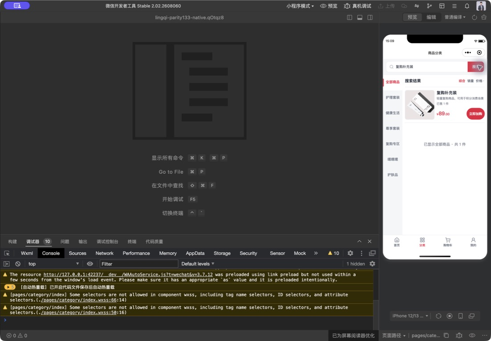

# 首页搜索进入分类验收

日期：2026-09-07；源码基线：f345674f；分支：codex/security-membership-payout。

## 行为和范围

按用户最新要求，首页点击搜索或键盘搜索后进入分类页并携带商品名称。热词/历史复用同一入口；关键词去首尾空格，清除分类页旧分类及排序，从第一页加载；空搜索进入全部商品。首页原分类筛选保留。跳转防重复，失败中央提示且保留输入，旧查询不能覆盖新结果。

仅修改原生首页、分类页JavaScript及相关测试。H5、后台、后端和现有商品/加购/限购规则未修改。本项明确覆盖此前首页原页搜索的设计。

## 自动验证

- 新增5项测试覆盖跨页传词、冷启动加载、旧响应/空搜索、导航失败/重复点击、热词历史与按钮/键盘绑定。
- 聚焦两套测试16/16，全量小程序357/357通过；工程JavaScript/JSON/结构/HTTPS检查、差异检查通过。
- 本增量没有修改模板/样式，未重跑官方模板编译；未重跑H5/后台/后端套件。

## 原生模拟器实测

使用隔离工程`/private/tmp/lingqi-parity133-native.qOtqz8`，名称“UI133-H5全量对照-本地禁止上传”，非正式AppID；商品来自公开只读快照，请求层拒绝真实写入。仅同步本轮两页JavaScript，不替换正式发布工程。

在390×844模拟器中，从首页输入“复购补充装”并实际点击搜索。原生界面进入`pages/category/index`，分类Tab选中，输入保留“复购补充装”，显示“搜索结果”及对应商品，底部为“已显示全部商品 · 共1件”。

最终控制台显示0个错误、10个累计警告（预加载、热更新和既有样式兼容等），不声称零告警。本次是原生模拟器路由/展示验证，不能代替真机键盘、真实网络搜索或交易验收。

## 发布状态

VERSION仍1.0.132，未同步正式上传目录、未上传腾讯、提审或部署服务器。公开H5静态115及后台132只读核验一致；后端状态沿用发布报告，本轮未重验。隔离工程包含验收请求层，严禁上传。
