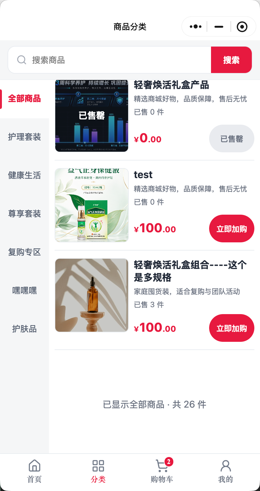

# 分类列表底部留白收口验收

日期：2026-09-14。最终结果：**passed（本轮分类列表结束区域）**。

## 问题与修改

- 用户截图中，最后一个商品与“已显示全部商品”之间存在大块空白。根因是列表结束提示复用了全站空状态的 `120rpx` 上下留白。
- 结束提示改用分类页专用样式，上/左右/下间距为 `24rpx / 18rpx / 32rpx`，不设置固定高度、最小高度或弹性撑开。
- 商品卡、分类栏、排序、分页、加购和固定底部导航均未改变；H5 分类页没有这段结束提示，不存在同一复用问题，因此本轮不做无关改动。

## 视觉与验证

- 参考：`reference.png`，用户提供的原分类页截图。
- 实现：微信开发者工具 iPhone 12/13 (Pro)，390×844、默认16号字体；隔离假数据、无真实令牌、所有外部写入被阻断。
- `category-compact-bottom.png` 使用与反馈一致的3商品场景。结束提示紧跟第三个商品，原先商品与提示之间的大块空白消失；底部导航保持固定，左右栏及页面宽度无溢出。
- 同轮还保存4商品常规场景 `category.png` / `category-bottom.png`，以及采集记录 `manifest.json`。参考图视口约414宽，最终模拟器为390宽，因此只判断用户要求的响应式间距和布局关系，不声称逐像素复刻。
- 小程序完整500项测试、工程结构/JSON/JavaScript/HTTPS检查及差异检查通过。新增回归明确禁止结束提示再次使用大间距 `.empty`。
- 本次只打开“禁止上传”的临时工程；验收后已关闭项目及微信开发者工具服务端口，9420和32227均无监听。

未操作真实商品、购物车、订单、付款或正式上传目录；未部署、上传或提审，VERSION保持1.0.141。
