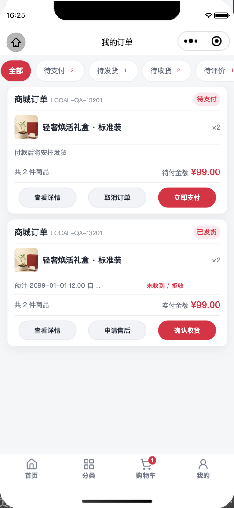
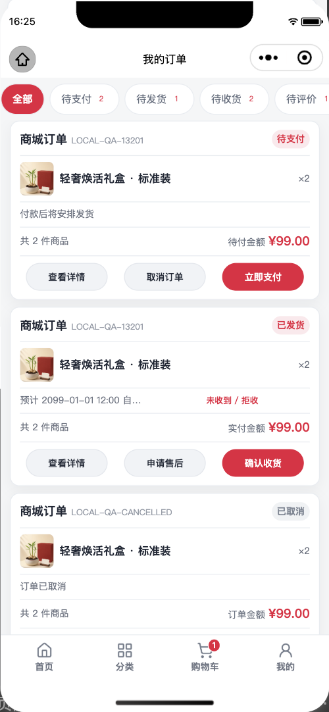

# 订单列表五行紧凑卡片验收

日期：2026-09-20  
范围：微信小程序订单列表、公开/一体化商城 H5 订单列表及两端共用界面规范。  
结果：通过；未发布。

## 已落实的统一规则

- 每张订单固定为标题/状态、商品、物流、件数/金额、操作五行。
- 标题与状态同一行，长订单号及长售后状态使用省略，不把卡片撑宽或撑高。
- 商品区只显示第一件商品摘要；多商品以“等 N 种”说明，不在列表展开全部商品。
- “未收到 / 拒收”保留原自动收货与售后资格门禁，移入物流行作为次级文字操作。
- 操作按钮禁止换行，单卡常见状态最多三枚；按钮按文案收宽，付款和确认收货等唯一主操作统一排在最右。
- 待支付、待发货、待收货、待评价及售后进行中的状态标签跟随商城主题色；操作区只有付款和确认收货使用主题色，去评价降为普通次操作；已取消为灰色，完成态使用中性完成色。
- 小程序与 H5 使用同名 `ui-order-*` 共用组件；界面规范检查会阻止任一端退回独立大卡或可换行按钮。

## 原生视觉核验

- 环境：微信开发者工具 2.02.2608060、基础库 3.7.12、iPhone 12/13 Pro、390×844、DPR 3。
- 数据：本地隔离合成订单，所有网络写入、授权和支付均被拦截。
- 页面：`pages/orders/index`，无加载错误或自动化异常。
- 待支付、已发货：三枚操作保持一行，主操作在最右；物流提示与金额各占一行。
- 已取消：状态标签为灰色，物流说明为中性色，不出现进行中主题色或操作区空白占位。
- 未发现横向溢出、商品重复展开、按钮掉行、标题/状态分行或底部导航遮挡。

用户提供的竞品和旧界面截图包含姓名、手机号、地址及订单号，只在本轮视觉对照中查看，未复制入仓库。参考用于信息密度、按钮层级和状态色关系，不复制对方品牌或业务模块。

## 自动验证与边界

- 小程序全量测试与工程/同源检查通过。
- H5 全量测试、公开/团队/一体化生产构建及界面共用规范检查通过。
- `git diff --check` 通过。
- 未操作真实订单、取消、确认收货、售后、评价或付款；业务接口、权限和原有状态门禁未修改。
- 未改 `VERSION`，未部署后端/H5/后台，未上传微信开发版，未提审或正式发布。
